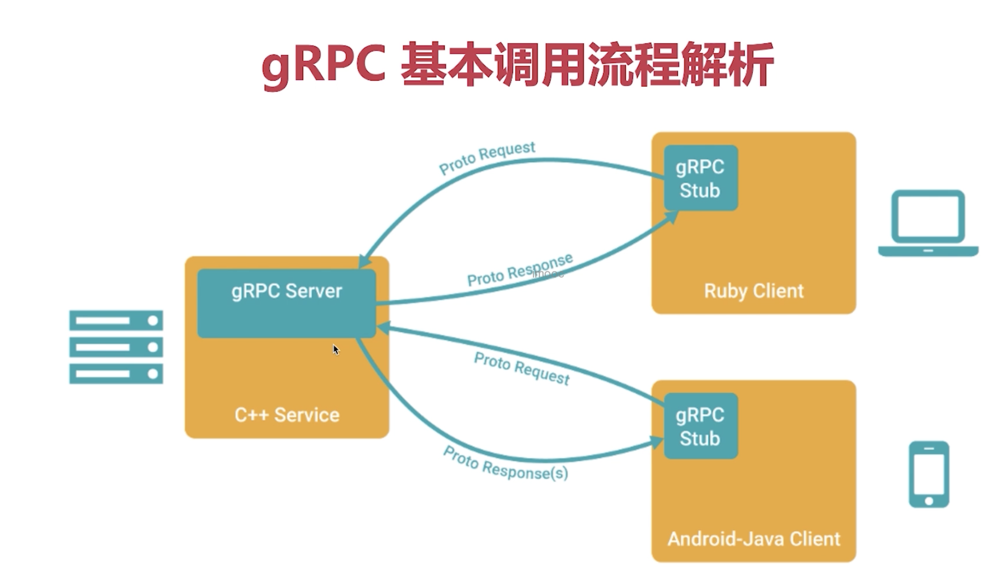
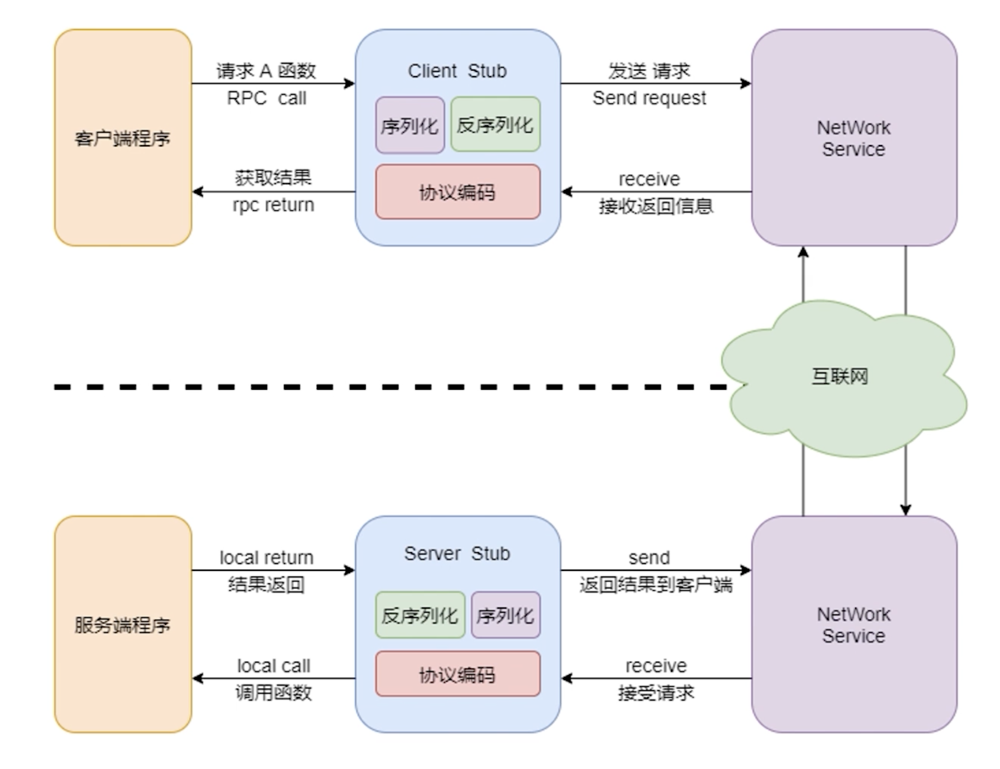
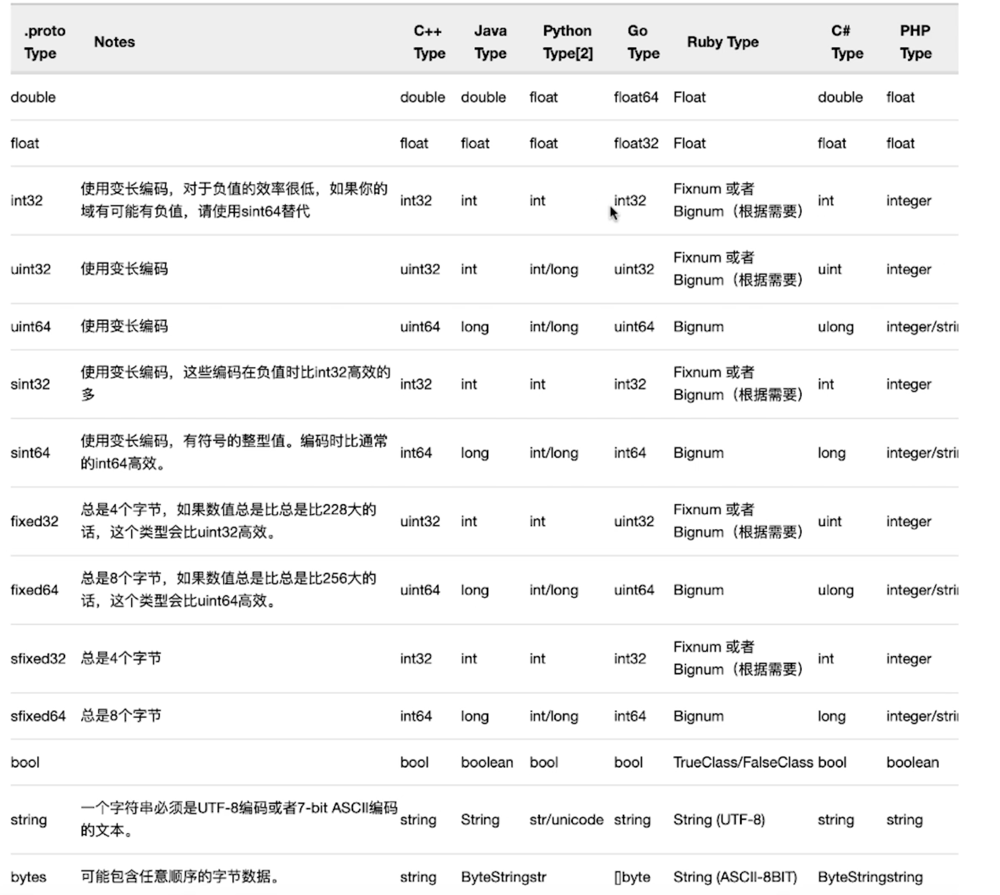

# gPRC&protoBuf

## PART1. gRPC

### 1.1 RPC是什么

- RPC:远程过程调用(Remote Procedure Call)
- 包含了传输协议和编码(对象序列号)协议
- 允许运行在一台计算机的程序调用另一台计算机的子程序

### 1.2 RPC的好处

- 简单
- 通用
- 安全
- 高效

### 1.3 gRPC是什么

- gRPC:高性能、开源、通用的RPC框架
- 基于HTTP2.0协议标准设计开发
- 支持多语言,默认采用Protocol Buffers数据序列化协议





## PART2. ProtoBuf

### 2.1 什么是Protocol Buffers

- 轻便高效的序列化结构化数据的协议
- 通常用在存储数据和需要远程数据通信的程序上
- 跨语言,更小(相较于JSON和XML而言)、更快、更简单

### 2.2 为什么使用Protocol Buffers

- 加速数据传输速度
- 解决数据传输不规范的问题

### 2.3 Protocol Buffers的常用概念

- Message:描述一个请求或响应的消息格式
- 字段标识:消息的定义中,每个字段都有一个唯一的数值标签
- 常用的数据类型:double,float,int32/64,bool,string,bytes
- Service:在Service中可以定义一个RPC服务接口

### 2.4 Protocol Buffers Message中的字段修饰符

- singular:表示成员有0个或者1个,一般省略不写
- repeated:表示该字段可以包含0-N个元素,可以理解为是GO中的切片



### 2.5 Protocol Buffers基本语法

```proto
// 语法版本
syntax = "proto3";

// 包名
package go.micro.service.product;

// service 定义用于被远程调用的服务
service Product {
  rpc AddProduct(ProductInfo) returns(ResponseProduct) {}
}

// message 用于定义属性
message ProductInfo {
  // 此处的 id = 1 并不是赋值 1是字段标识符
  // 字段修饰符在proto3中可省略不写
  int64 id = 1;

  // 常用字段标识符为1-15 超过15之后 会开2个字节来存储属性
  string product_name = 2;
}

message ResponseProduct {
  // 字段标识符的作用域为message
  int64 product_id = 1;
}
```

### 2.6 使用Docker根据.proto文件生成微服务文件

```
yanglei@192 code % tree ./
./
├── go.mod
├── go.sum
└── product.proto

0 directories, 3 files
```

```
docker pull cap1573/cap-protoc
docker run --rm -v $(PWD):$(PWD) -w $(PWD) \
> -e ICODE=7DD47DEF3E0D096A cap1573/cap-protoc \
> -I ./ --go_out=./ --micro_out=./ ./*.proto
恭喜，恭喜命令执行成功！%   
```

- `-w`:指定容器的工作路径

TODO: `-I`是干啥的参数?

```
yanglei@192 code % tree ./
./
├── go.mod
├── go.sum
├── product.pb.go
├── product.pb.micro.go
└── product.proto

0 directories, 5 files
```

TODO:protoc怎么装?

Tip:把protoc打成一个容器,是一种好的做法

