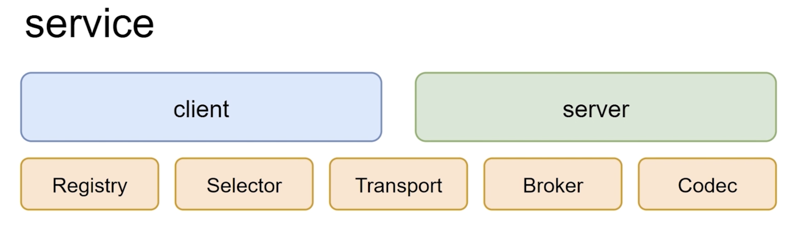
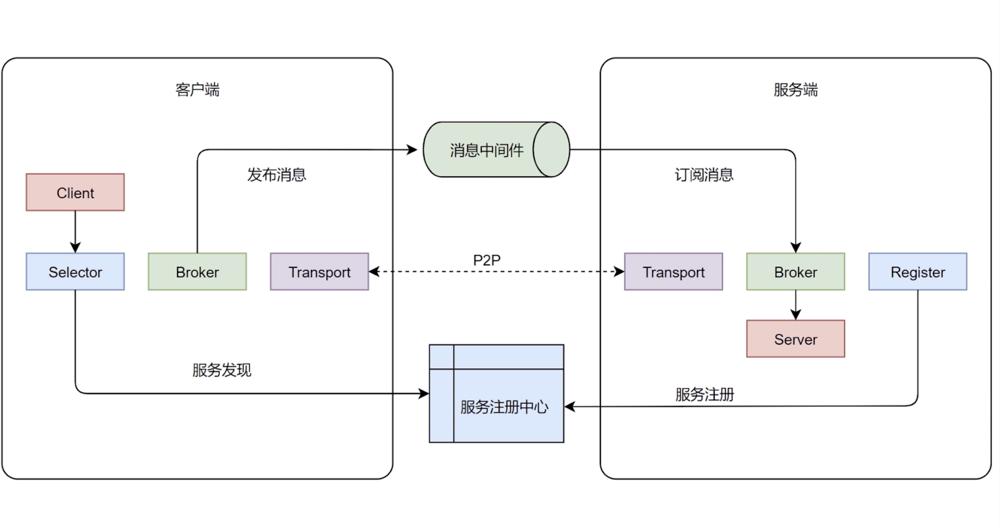

# component and communication of go-micro 

## PART1. Micro是什么?

- 用来构建和管理分布式程序的系统
- Runtime:用于管理配置,认证,网络
- Framework:程序开发框架,用于编写微服务
- Clients:支持多语言访问服务端

### 1.1 Micro中Runtime介绍

- 是一个工具集,工具名称为`micro`
- 官方docker版本:`docker pull micro/micro`
- 本课扩展版本:`docker pull cap1573/cap-micro`

### 1.2 Runtime组成

- api:api网关
- broker:允许异步消息的消息代理
- network:通过微网络服务构建多云网络
- new:服务模板生成器
- proxy:建立在Go Micro上的透明服务代理
- registry:服务资源管理器
- store:简单的状态存储
- web:web控制台允许浏览服务

## PART2. go-micro的核心知识点

### 2.1 go-micro介绍

- 是对分布式系统的高度抽象
- 提供分布式系统开发的和辛苦
- 可插拔的架构,按需使用

### 2.2 go-micro组件

- 注册(Registry):提供服务发现机制
- 选择器(Selector):实现负载均衡
- 传输(Transport):服务与服务之间的通信接口
- Broker:提供异步通信的消息发布/订阅接口
- 编码(Codec):消息传输到两端时进行编码和解码
- Server&Client:服务端与客户端





- step1. Client通过Selector到服务注册中心进行服务发现;Server通过Register到服务注册中心进行服务注册
- step2. Broker通过一些消息中间件(例如RabbitMQ等)进行消息转发
- step3. Transport直连

## PART3. go-micro简单的hello world

### 3.1 Proto编写

#### 3.1.1 编写proto

```
tree ./
./
└── proto    // 存放proto的路径
    └── roach
        └── imooc.proto

2 directories, 1 file
```

`imooc.proto`:

```proto
syntax = "proto3";

package go.micro.service.imooc;

service Roach {
  rpc SayHello(SayRequest) returns (SayResponse) {}
}

message SayRequest {
  string message = 1;
}

message SayResponse {
  string answer = 1;
}
```

#### 3.1.2 生成go代码

```
docker run --rm -v $(PWD):$(PWD) -w $(PWD) \
> -e ICODE=7DD47DEF3E0D096A cap1573/cap-protoc \
> -I ./ --go_out=./ --micro_out=./ ./*.proto
恭喜，恭喜命令执行成功！%
```

```
tree ./
./
└── proto
    └── roach
        ├── imooc.pb.go
        ├── imooc.pb.micro.go
        └── imooc.proto

2 directories, 3 files
```

### 3.2 服务端编写

在工程根目录下初始化项目:

```
go mod init roach-imooc
```

```
tree ./ 
./
├── go.mod
└── proto
    └── roach
        ├── imooc.pb.go
        ├── imooc.pb.micro.go
        └── imooc.proto

2 directories, 4 files
```

创建`server.go`:

```
tree ./
./
├── go.mod
├── go.sum
├── proto
│   └── roach
│       ├── imooc.pb.go
│       ├── imooc.pb.micro.go
│       └── imooc.proto
└── server.go

2 directories, 6 files
```

```go
package main

import (
	"context"
	"fmt"
	"github.com/micro/go-micro/v2"
	imooc "roach-imooc/proto/roach"
)

// RoachServer 需要实现接口RoachService
// 这个接口是protoc生成的 pb.micro.go
type RoachServer struct{}

func (r *RoachServer) SayHello(ctx context.Context, in *imooc.SayRequest, out *imooc.SayResponse) error {
	// 业务逻辑代码
	out.Answer = "SayHello的响应"
	return nil
}

func main() {
	// 创建新的服务
	service := micro.NewService(
		// 服务名 可以认为是服务的ID 是一个唯一标识符
		// Client通过这个name来找server
		micro.Name("roach.imooc.server"),
	)

	// 初始化服务
	service.Init()

	// 注册服务
	// 此处是pb自动生成的imooc.pb.go中的方法
	imooc.RegisterRoachHandler(service.Server(), new(RoachServer))

	// 运行服务
	err := service.Run()

	if err != nil {
		fmt.Println(err)
	}
}
```

运行:直接在GoLand中Run即可

Tips:若这一步报缺少包,缺啥`go get`啥即可

### 3.3 Client端编写

创建`client.go`:

```
tree ./
./
├── client.go
├── go.mod
├── go.sum
├── proto
│   └── roach
│       ├── imooc.pb.go
│       ├── imooc.pb.micro.go
│       └── imooc.proto
└── server.go

2 directories, 7 files
```

`client.go`:

```go
package main

import (
	"context"
	"fmt"
	"github.com/micro/go-micro/v2"
	imooc "roach-imooc/proto/roach"
)

func main() {
	// 创建新的服务
	service := micro.NewService(
		micro.Name("roach.imooc.server"),
	)

	// 初始化
	service.Init()

	roachImooc := imooc.NewRoachService("roach.imooc.server", service.Client())

	res, err := roachImooc.SayHello(context.TODO(), &imooc.SayRequest{Message: "客户端发送的请求"})

	if err != nil {
		fmt.Println(err)
	}

	fmt.Printf("%s\n", res.Answer)
}
```

运行:直接在GoLand中Run即可

```
GOROOT=/usr/local/go #gosetup
GOPATH=/Users/yanglei/Desktop/myGoPath #gosetup
/usr/local/go/bin/go build -o /private/var/folders/9x/kkdcw3dx7js8frvbxh8gns580000gn/T/GoLand/___go_build_client_go /Users/yanglei/Desktop/go-microservice/code/2-4/client.go #gosetup
/private/var/folders/9x/kkdcw3dx7js8frvbxh8gns580000gn/T/GoLand/___go_build_client_go
SayHello的响应

Process finished with the exit code 0
```