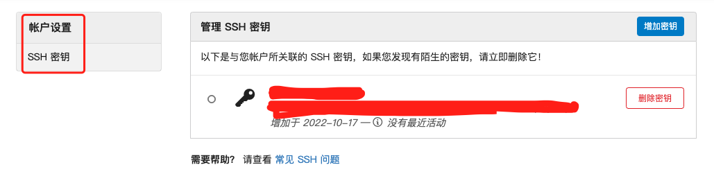

#  privatization of go mod and gorm

## PART1. go Module私有化设置 & gorm使用

### 1.1 Go Module基本设置

要求: go >= 1.13

注意:Go Module使用GOPROXY环境变量来解决无法使用go get的问题

### 1.2 Go Module私有仓库设置

```
vim ~/.zshrc
# 结尾处添加
export GOPRIVATE="*.imooc.com"
source ~/.zshrc
```

### 1.3 项目ssh设置

- step1. 生成/获取密钥

	- a. 生成密钥:`ssh-keygen -t rsa -C "40486453@qq.com"`
	- b. 获取密钥:`cat ~/.ssh/id_rsa.pub`

- step2. 添加密钥到用户



### 1.4 Go Module设置慕课网git转发

`go get`内部使用`git clone`命令,默认只支持公有仓库

解决方案:替换https为ssh请求

`git config --global url."ssh://git@git.imooc.com:80/".insteadOf "https://git.imooc.com"`

## PART2. GORM基本介绍及使用

### 2.1 什么是GORM

go语言的ORM

### 2.2 GORM库依赖说明

- `go get github.com/jinzhu/gorm`
- `go get github.com/go-sql-driver/mysql`
- `gorm.Open("mysql", "root:123456@/test?charset=utf8&parseTime=True&loc=Local")`