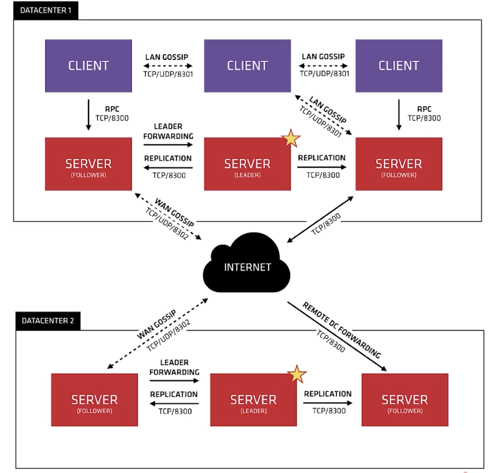
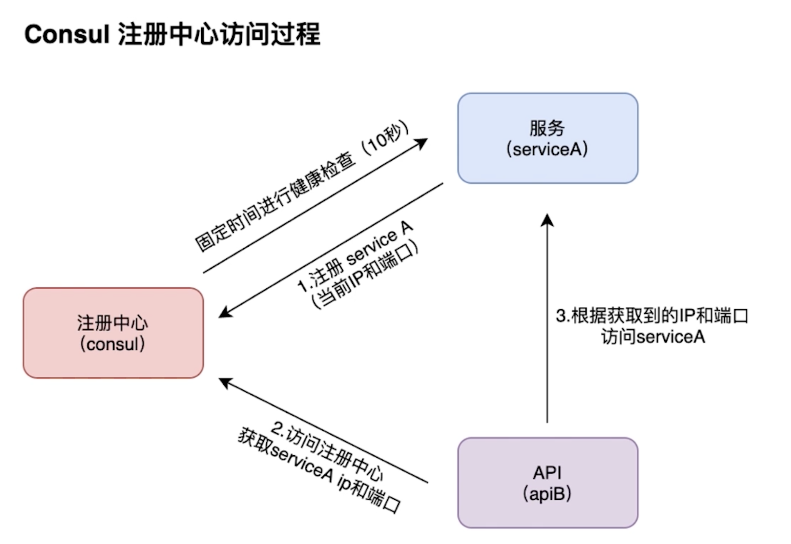

# introduction registration center

## PART1. 注册中心Consul原理介绍

### 1.1 Consul基本介绍

- Consul是一种服务网格解决方案
- 提供具有服务发现,配置和分段功能的全功能控制平面
- Consul附带一个简单的内置代理,可以开箱即用

### 1.2 Consul关键功能:注册中心

- 服务发现:客户端可以注册服务,程序可以轻松找到它们所依赖的服务

	- 让服务可以找到它所依赖的服务.可以将服务的IP、端口告知Consul,让Consul记录下来
	
- 运行状况检查:Consul客户端可以提供任意数量的运行状况检查

	- 服务注册到Consul后,Consul会定期检测服务的状态是否存活

- KV存储:应用程序可以将Consul的层级键/值存储用于任何目的,包括动态配置,功能标记,协调,领导者选举等
- 安全服务通信:Consul可以为服务生成和分发TLS证书,建立相互的TLS连接
- 多数据中心:Consul支持多数据中心(集群联邦)

### 1.2 调用过程原理讲解及集群版本原理

多DC之间要通过WAN GOSSIP协议进行数据交互.每个DC中的数据由Client端通过LAN GOSSIP协议请求Server端,以便获取服务的状态

Client端以rpc方式,通过LAN GOSSIP协议访问Server端(默认端口8300).Client端之间也是通过LAN GOSSIP协议进行数据同步

Server端有选举机制.Client访问到Follower的Server时,实际上会通过Leader的Server访问数据,再返回给Client端

### 1.3 注册中心Consul的2个重要协议

#### 1.3.1 Gossip Protocol:八卦协议

当某个节点上发生了一个事件之后,其他节点需要知道这个事件.打听的消息越多,节点信息的状态更新的越快

##### a. 局域网池(LAN Pool)

- 让Client自动发现Server节点,减少所需的配置量
- 分布式故障检测时,在某几个Server机上执行
- 能够快速广播事件

##### b. 广域网池(WAN Pool)

- WAN Pool全局唯一
- 不同DC的Server都会加入WAN Pool
- 允许服务器执行跨DC的请求

#### 1.3.2 Raft Protocol:选举协议

用于选主

[RFAT协议演示](http://thesecretlivesofdata.com/raft/)

### 1.4 Consul的主要特性

- 服务发现
- 健康检查
- K-V存储

### 1.5 Consul注册中心访问过程

**TODO:这部分的慕课网电子书要看**