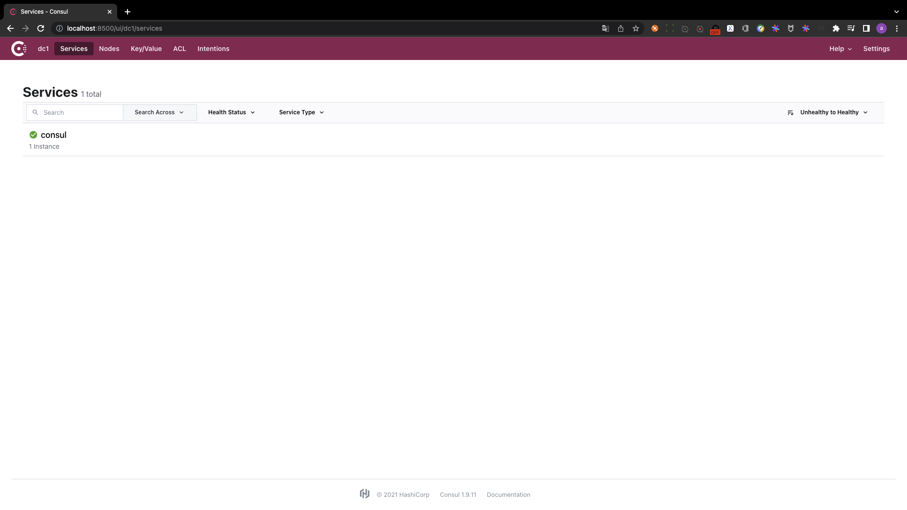

# install consul

## PART1. 注册中心Consul的安装

- step1. 拉取镜像

```
docker pull cap1573/consul 
Using default tag: latest
latest: Pulling from cap1573/consul
5758d4e389a3: Pull complete 
379896a44a3f: Pull complete 
b2921a3837a1: Pull complete 
8079d6a33a1e: Pull complete 
3cd09fcf3d2c: Pull complete 
7abac1e88238: Pull complete 
latest: Pulling from cap1573/consul
5758d4e389a3: Already exists 
379896a44a3f: Already exists 
b2921a3837a1: Already exists 
8079d6a33a1e: Already exists 
3cd09fcf3d2c: Already exists 
7abac1e88238: Already exists 
Digest: sha256:9fb22811c2a466b42376b0e9a0e6ad229b16d059f458b61f112ff9dfb97a2e2b
Status: Downloaded newer image for cap1573/consul:latest
docker.io/cap1573/consul:latest
```

- step2. 运行

```
 docker run -d -p 8500:8500 cap1573/consul
a537ca1701e5dd1da3880383d39e7400afe4fdadfb8e2f395e065ff352a0378c
```

- step3. 检查

```
docker ps   
CONTAINER ID   IMAGE            COMMAND                  CREATED         STATUS         PORTS                                                                      NAMES
a537ca1701e5   cap1573/consul   "docker-entrypoint.s…"   4 seconds ago   Up 4 seconds   8300-8302/tcp, 8301-8302/udp, 8600/tcp, 8600/udp, 0.0.0.0:8500->8500/tcp   admiring_spence
```

## PART2. Consul管理页面

