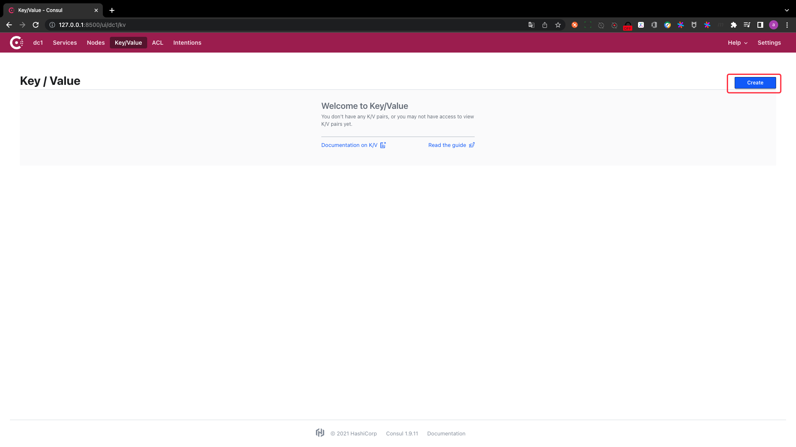
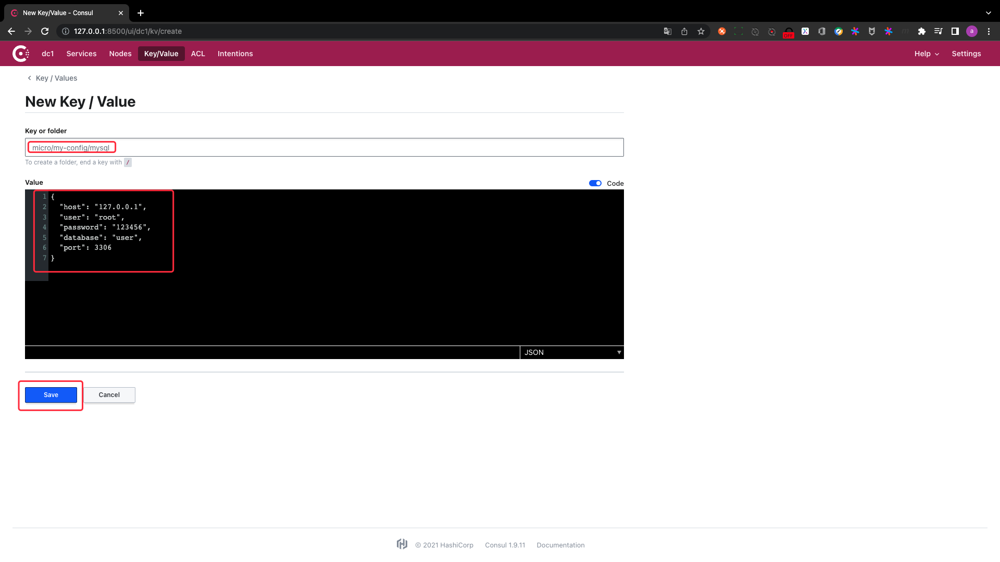
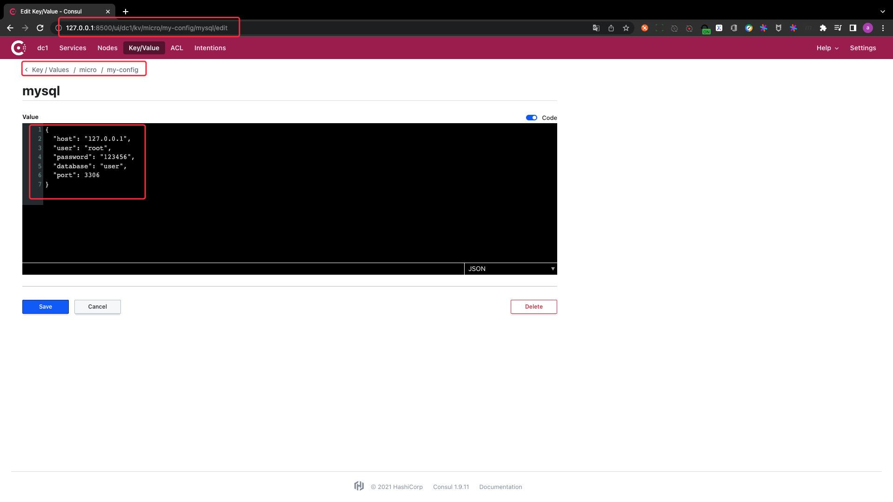
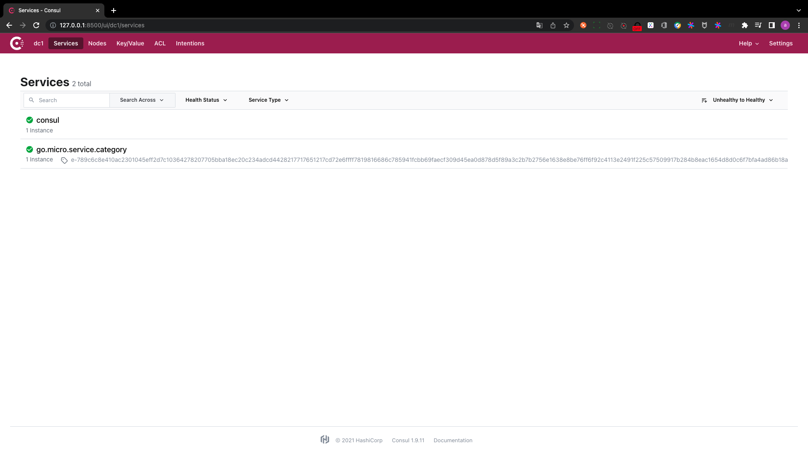
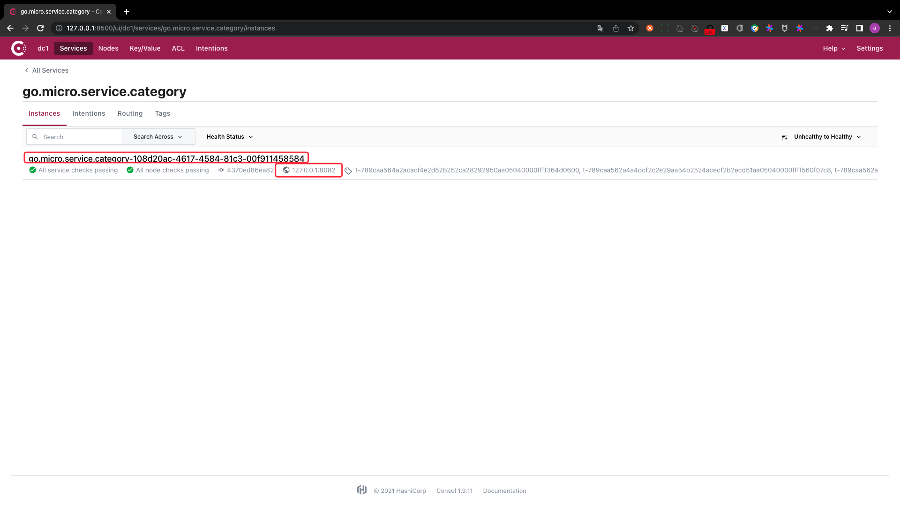

# complete the config of consul

## PART1. 注册中心和配置中心的区别

### 1.1 注册中心

注册中心用于给每个微服务注册自身的地址和端口用的

### 1.2 配置中心

配置中心用于给每个微服务读取启动相关的配置(如MySQL用户名、密码、端口、使用的数据库等)

## PART2. 使用注册中心

`main.go`:

```go
package main

import (
	"git.imooc.com/cap1573/category/common"
	"git.imooc.com/cap1573/category/handler"
	category "git.imooc.com/cap1573/category/proto/category"
	_ "github.com/jinzhu/gorm/dialects/mysql"
	"github.com/micro/go-micro/v2"
	log "github.com/micro/go-micro/v2/logger"
	"github.com/micro/go-micro/v2/registry"
	"github.com/micro/go-plugins/registry/consul/v2"
)

func main() {
	// 获取配置中心
	host := "127.0.0.1"
	port := 8500
	prefix := "/micro/my-config"
	conf, err := common.GetConsulConfig(host, int64(port), prefix)
	if err != nil {
		log.Error(err)
	}

	// 获取注册中心
	consulRegistry := consul.NewRegistry(func(options *registry.Options) {
		options.Addrs = []string{
			"127.0.0.1:8500",
		}
	})

	// New Service
	service := micro.NewService(
		micro.Name("go.micro.service.category"),
		micro.Version("latest"),
		// 设置微服务的地址和监听的端口
		micro.Address("127.0.0.1:8082"),
		// 指定使用consul作为注册中心
		micro.Registry(consulRegistry),
	)

	// Initialise service
	service.Init()

	// Register Handler
	category.RegisterCategoryHandler(service.Server(), new(handler.Category))

	// Run service
	if err := service.Run(); err != nil {
		log.Fatal(err)
	}
}
```

## PART3. 使用配置中心

### 3.1 实现从Consul中读取MySQL配置的函数`GetMySQLConf`

由于这个功能所有的domain(就是所有的微服务)都要使用,故该函数应该放在`user/git.imooc.com/cap1573/category/common`中

`user/git.imooc.com/cap1573/category/common/mysql.go`:

```go
package common

import "github.com/micro/go-micro/v2/config"

type MySQLConfig struct {
	// Host MySQL实例的地址
	Host string `json:"host"`

	// Port MySQL实例的端口
	Port int64 `json:"port"`

	// User MySQL实例的用户名
	User string `json:"user"`

	// Password MySQL实例的密码
	Password string `json:"password"`

	// DataBase 每个domain所使用的数据库
	DataBase string `json:"database"`
}

// GetMySQLConf 本函数用于从Consul中读取MySQL相关的配置
func GetMySQLConf(config config.Config, path ...string) (*MySQLConfig, error) {
	mysqlConf := &MySQLConfig{}
	err := config.Get(path...).Scan(mysqlConf)
	if err != nil {
		return nil, err
	}
	return mysqlConf, nil
}
```

### 3.2 从Consul中读取MySQL的配置

`main.go`:

```go
package main

import (
	"git.imooc.com/cap1573/category/common"
	"git.imooc.com/cap1573/category/handler"
	category "git.imooc.com/cap1573/category/proto/category"
	_ "github.com/jinzhu/gorm/dialects/mysql"
	"github.com/micro/go-micro/v2"
	log "github.com/micro/go-micro/v2/logger"
	"github.com/micro/go-micro/v2/registry"
	"github.com/micro/go-plugins/registry/consul/v2"
)

func main() {
	// 获取配置中心
	host := "127.0.0.1"
	port := 8500
	prefix := "/micro/my-config"
	conf, err := common.GetConsulConfig(host, int64(port), prefix)
	if err != nil {
		log.Error(err)
	}

	// 获取注册中心
	consulRegistry := consul.NewRegistry(func(options *registry.Options) {
		options.Addrs = []string{
			"127.0.0.1:8500",
		}
	})

	// New Service
	service := micro.NewService(
		micro.Name("go.micro.service.category"),
		micro.Version("latest"),
		// 设置微服务的地址和监听的端口
		micro.Address("127.0.0.1:8082"),
		// 指定使用consul作为注册中心
		micro.Registry(consulRegistry),
	)

	// 从配置中心中获取MySQL的配置
	// 由于初始化配置中心时 设置了可以不用带前缀 所以path处可以不写前面的'/micro/config'
	mysqlConf, err := common.GetMySQLConf(conf, "mysql")
	if err != nil {
		log.Error(err)
	}

	// Initialise service
	service.Init()

	// Register Handler
	category.RegisterCategoryHandler(service.Server(), new(handler.Category))

	// Run service
	if err = service.Run(); err != nil {
		log.Fatal(err)
	}
}
```

## PART4. 根据MySQL的配置创建连接句柄并初始化数据表

### 4.1 根据MySQL的配置创建连接句柄

`main.go`:

```go
package main

import (
	"git.imooc.com/cap1573/category/common"
	"git.imooc.com/cap1573/category/handler"
	category "git.imooc.com/cap1573/category/proto/category"
	"github.com/jinzhu/gorm"
	_ "github.com/jinzhu/gorm/dialects/mysql"
	"github.com/micro/go-micro/v2"
	log "github.com/micro/go-micro/v2/logger"
	"github.com/micro/go-micro/v2/registry"
	"github.com/micro/go-plugins/registry/consul/v2"
)

func main() {
	// 获取配置中心
	host := "127.0.0.1"
	port := 8500
	prefix := "/micro/my-config"
	conf, err := common.GetConsulConfig(host, int64(port), prefix)
	if err != nil {
		log.Error(err)
	}

	// 获取注册中心
	consulRegistry := consul.NewRegistry(func(options *registry.Options) {
		options.Addrs = []string{
			"127.0.0.1:8500",
		}
	})

	// New Service
	service := micro.NewService(
		micro.Name("go.micro.service.category"),
		micro.Version("latest"),
		// 设置微服务的地址和监听的端口
		micro.Address("127.0.0.1:8082"),
		// 指定使用consul作为注册中心
		micro.Registry(consulRegistry),
	)

	// 从配置中心中获取MySQL的配置
	// 由于初始化配置中心时 设置了可以不用带前缀 所以path处可以不写前面的'/micro/config'
	mysqlConf, err := common.GetMySQLConf(conf, "mysql")
	if err != nil {
		log.Error(err)
	}

	// 根据配置连接DB
	db, err := gorm.Open("mysql", mysqlConf.User+":"+mysqlConf.Password+
		"@/"+mysqlConf.DataBase+"?charset=utf8&parseTime=True&loc=Local")
	if err != nil {
		log.Error(err)
	}
	defer db.Close()
	// 禁止复表
	db.SingularTable(true)

	// Initialise service
	service.Init()

	// Register Handler
	category.RegisterCategoryHandler(service.Server(), new(handler.Category))

	// Run service
	if err = service.Run(); err != nil {
		log.Fatal(err)
	}
}
```

### 4.2 初始化数据表

`main.go`:

```go
package main

import (
	"git.imooc.com/cap1573/category/common"
	"git.imooc.com/cap1573/category/handler"
	category "git.imooc.com/cap1573/category/proto/category"
	"github.com/jinzhu/gorm"
	_ "github.com/jinzhu/gorm/dialects/mysql"
	"github.com/micro/go-micro/v2"
	log "github.com/micro/go-micro/v2/logger"
	"github.com/micro/go-micro/v2/registry"
	"github.com/micro/go-plugins/registry/consul/v2"
)

func main() {
	// 获取配置中心
	host := "127.0.0.1"
	port := 8500
	prefix := "/micro/my-config"
	conf, err := common.GetConsulConfig(host, int64(port), prefix)
	if err != nil {
		log.Error(err)
	}

	// 获取注册中心
	consulRegistry := consul.NewRegistry(func(options *registry.Options) {
		options.Addrs = []string{
			"127.0.0.1:8500",
		}
	})

	// New Service
	service := micro.NewService(
		micro.Name("go.micro.service.category"),
		micro.Version("latest"),
		// 设置微服务的地址和监听的端口
		micro.Address("127.0.0.1:8082"),
		// 指定使用consul作为注册中心
		micro.Registry(consulRegistry),
	)

	// 从配置中心中获取MySQL的配置
	// 由于初始化配置中心时 设置了可以不用带前缀 所以path处可以不写前面的'/micro/config'
	mysqlConf, err := common.GetMySQLConf(conf, "mysql")
	if err != nil {
		log.Error(err)
	}

	// 根据配置连接DB
	db, err := gorm.Open("mysql", mysqlConf.User+":"+mysqlConf.Password+
		"@/"+mysqlConf.DataBase+"?charset=utf8&parseTime=True&loc=Local")
	if err != nil {
		log.Error(err)
	}
	defer db.Close()
	// 禁止复表
	db.SingularTable(true)
	// 初始化数据表 仅执行1次
	rp := repository.NewCategoryRepository(db)
	rp.InitTable()

	// Initialise service
	service.Init()

	// Register Handler
	category.RegisterCategoryHandler(service.Server(), new(handler.Category))

	// Run service
	if err = service.Run(); err != nil {
		log.Fatal(err)
	}
}
```

## PART5. 创建Service层并注册handler

### 5.1 创建Service层

实际上这个Service层就是我平常写代码时的Biz层

`main.go`:

```go
package main

import (
	"git.imooc.com/cap1573/category/common"
	"git.imooc.com/cap1573/category/domain/repository"
	service2 "git.imooc.com/cap1573/category/domain/service"
	"git.imooc.com/cap1573/category/handler"
	category "git.imooc.com/cap1573/category/proto/category"
	"github.com/jinzhu/gorm"
	_ "github.com/jinzhu/gorm/dialects/mysql"
	"github.com/micro/go-micro/v2"
	log "github.com/micro/go-micro/v2/logger"
	"github.com/micro/go-micro/v2/registry"
	"github.com/micro/go-plugins/registry/consul/v2"
)

func main() {
	// 获取配置中心
	host := "127.0.0.1"
	port := 8500
	prefix := "/micro/my-config"
	conf, err := common.GetConsulConfig(host, int64(port), prefix)
	if err != nil {
		log.Error(err)
	}

	// 获取注册中心
	consulRegistry := consul.NewRegistry(func(options *registry.Options) {
		options.Addrs = []string{
			"127.0.0.1:8500",
		}
	})

	// New Service
	service := micro.NewService(
		micro.Name("go.micro.service.category"),
		micro.Version("latest"),
		// 设置微服务的地址和监听的端口
		micro.Address("127.0.0.1:8082"),
		// 指定使用consul作为注册中心
		micro.Registry(consulRegistry),
	)

	// 从配置中心中获取MySQL的配置
	// 由于初始化配置中心时 设置了可以不用带前缀 所以path处可以不写前面的'/micro/config'
	mysqlConf, err := common.GetMySQLConf(conf, "mysql")
	if err != nil {
		log.Error(err)
	}

	// 根据配置连接DB
	db, err := gorm.Open("mysql", mysqlConf.User+":"+mysqlConf.Password+
		"@/"+mysqlConf.DataBase+"?charset=utf8&parseTime=True&loc=Local")
	if err != nil {
		log.Error(err)
	}
	defer db.Close()
	// 禁止复表
	db.SingularTable(true)
	// 初始化数据表 仅执行1次
	rp := repository.NewCategoryRepository(db)
	rp.InitTable()

	// Initialise service
	service.Init()

	// 创建service层
	categoryDataService := service2.NewCategoryDataService(repository.NewCategoryRepository(db))

	// Register Handler
	category.RegisterCategoryHandler(service.Server(), new(handler.Category))

	// Run service
	if err = service.Run(); err != nil {
		log.Fatal(err)
	}
}
```

### 5.2 注册handler

`main.go`:

```go
package main

import (
	"git.imooc.com/cap1573/category/common"
	"git.imooc.com/cap1573/category/domain/repository"
	service2 "git.imooc.com/cap1573/category/domain/service"
	"git.imooc.com/cap1573/category/handler"
	category "git.imooc.com/cap1573/category/proto/category"
	"github.com/jinzhu/gorm"
	_ "github.com/jinzhu/gorm/dialects/mysql"
	"github.com/micro/go-micro/v2"
	log "github.com/micro/go-micro/v2/logger"
	"github.com/micro/go-micro/v2/registry"
	"github.com/micro/go-plugins/registry/consul/v2"
)

func main() {
	// 获取配置中心
	host := "127.0.0.1"
	port := 8500
	prefix := "/micro/my-config"
	conf, err := common.GetConsulConfig(host, int64(port), prefix)
	if err != nil {
		log.Error(err)
	}

	// 获取注册中心
	consulRegistry := consul.NewRegistry(func(options *registry.Options) {
		options.Addrs = []string{
			"127.0.0.1:8500",
		}
	})

	// New Service
	service := micro.NewService(
		micro.Name("go.micro.service.category"),
		micro.Version("latest"),
		// 设置微服务的地址和监听的端口
		micro.Address("127.0.0.1:8082"),
		// 指定使用consul作为注册中心
		micro.Registry(consulRegistry),
	)

	// 从配置中心中获取MySQL的配置
	// 由于初始化配置中心时 设置了可以不用带前缀 所以path处可以不写前面的'/micro/config'
	mysqlConf, err := common.GetMySQLConf(conf, "mysql")
	if err != nil {
		log.Error(err)
	}

	// 根据配置连接DB
	db, err := gorm.Open("mysql", mysqlConf.User+":"+mysqlConf.Password+
		"@/"+mysqlConf.DataBase+"?charset=utf8&parseTime=True&loc=Local")
	if err != nil {
		log.Error(err)
	}
	defer db.Close()
	// 禁止复表
	db.SingularTable(true)
	// 初始化数据表 仅执行1次
	rp := repository.NewCategoryRepository(db)
	rp.InitTable()

	// Initialise service
	service.Init()

	// 创建service层
	categoryDataService := service2.NewCategoryDataService(repository.NewCategoryRepository(db))

	// 注册handler
	handlerLayer := &handler.Category{CategoryDataService: categoryDataService}
	err = category.RegisterCategoryHandler(service.Server(), handlerLayer)
	if err != nil {
		log.Error(err)
	}

	// Run service
	if err = service.Run(); err != nil {
		log.Fatal(err)
	}
}
```

注:别忘了删掉生成的代码中注册handler的部分

至此,编码工作全部完成

## PART6. Consul的使用

### 6.1 添加MySQL的配置到Consul

此时虽然代码实现了从Consul读取MySQL的配置,但是还没有将这些配置项写到Consul中







注:查看时的URL和添加时是不同的

注:

若编译时报错:

```
# golang.org/x/sys/unix
../../../../myGoPath/pkg/mod/golang.org/x/sys@v0.0.0-20200523222454-059865788121/unix/syscall_darwin.1_13.go:29:3: //go:linkname must refer to declared function or variable
../../../../myGoPath/pkg/mod/golang.org/x/sys@v0.0.0-20200523222454-059865788121/unix/zsyscall_darwin_amd64.1_13.go:27:3: //go:linkname must refer to declared function or variable
../../../../myGoPath/pkg/mod/golang.org/x/sys@v0.0.0-20200523222454-059865788121/unix/zsyscall_darwin_amd64.1_13.go:40:3: //go:linkname must refer to declared function or variable
../../../../myGoPath/pkg/mod/golang.org/x/sys@v0.0.0-20200523222454-059865788121/unix/zsyscall_darwin_amd64.go:28:3: //go:linkname must refer to declared function or variable
../../../../myGoPath/pkg/mod/golang.org/x/sys@v0.0.0-20200523222454-059865788121/unix/zsyscall_darwin_amd64.go:43:3: //go:linkname must refer to declared function or variable
../../../../myGoPath/pkg/mod/golang.org/x/sys@v0.0.0-20200523222454-059865788121/unix/zsyscall_darwin_amd64.go:59:3: //go:linkname must refer to declared function or variable
../../../../myGoPath/pkg/mod/golang.org/x/sys@v0.0.0-20200523222454-059865788121/unix/zsyscall_darwin_amd64.go:75:3: //go:linkname must refer to declared function or variable
../../../../myGoPath/pkg/mod/golang.org/x/sys@v0.0.0-20200523222454-059865788121/unix/zsyscall_darwin_amd64.go:90:3: //go:linkname must refer to declared function or variable
../../../../myGoPath/pkg/mod/golang.org/x/sys@v0.0.0-20200523222454-059865788121/unix/zsyscall_darwin_amd64.go:105:3: //go:linkname must refer to declared function or variable
../../../../myGoPath/pkg/mod/golang.org/x/sys@v0.0.0-20200523222454-059865788121/unix/zsyscall_darwin_amd64.go:121:3: //go:linkname must refer to declared function or variable
../../../../myGoPath/pkg/mod/golang.org/x/sys@v0.0.0-20200523222454-059865788121/unix/zsyscall_darwin_amd64.go:121:3: too many errors
```

执行`go get -u golang.org/x/sys`即可

## PART7. 编译并执行

```
/usr/local/go/bin/go build -o /private/var/folders/9x/kkdcw3dx7js8frvbxh8gns580000gn/T/GoLand/___go_build_main_go__1_ /Users/yanglei/Desktop/user/git.imooc.com/cap1573/category/main.go #gosetup
/private/var/folders/9x/kkdcw3dx7js8frvbxh8gns580000gn/T/GoLand/___go_build_main_go__1_
2022-11-03 00:24:05  file=v2@v2.9.1/service.go:200 level=info Starting [service] go.micro.service.category
2022-11-03 00:24:05  file=grpc/grpc.go:864 level=info Server [grpc] Listening on 127.0.0.1:8082
2022-11-03 00:24:05  file=grpc/grpc.go:697 level=info Registry [consul] Registering node: go.micro.service.category-2c5037a0-a843-48f2-848b-9dbc270e8035
```



