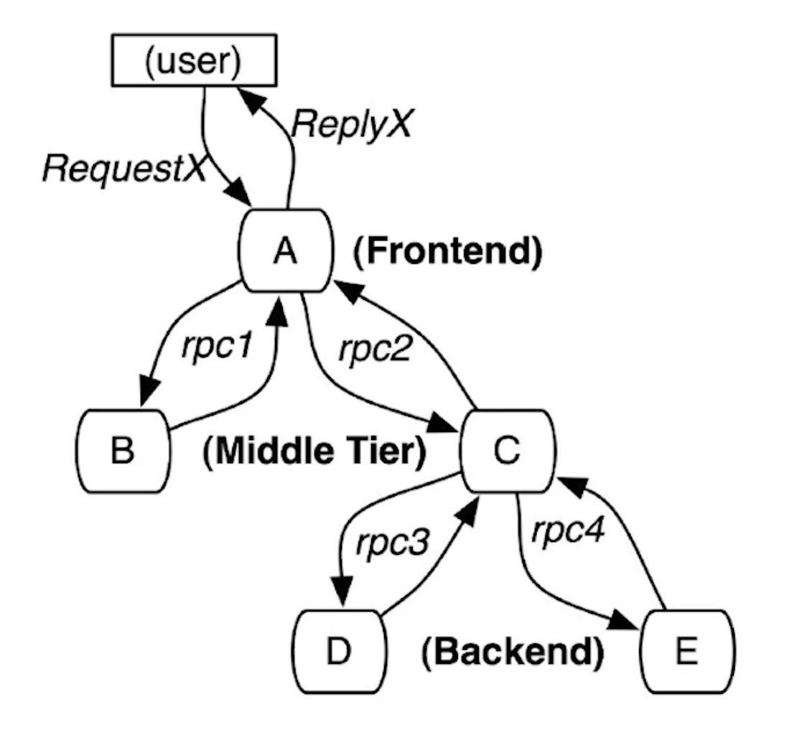
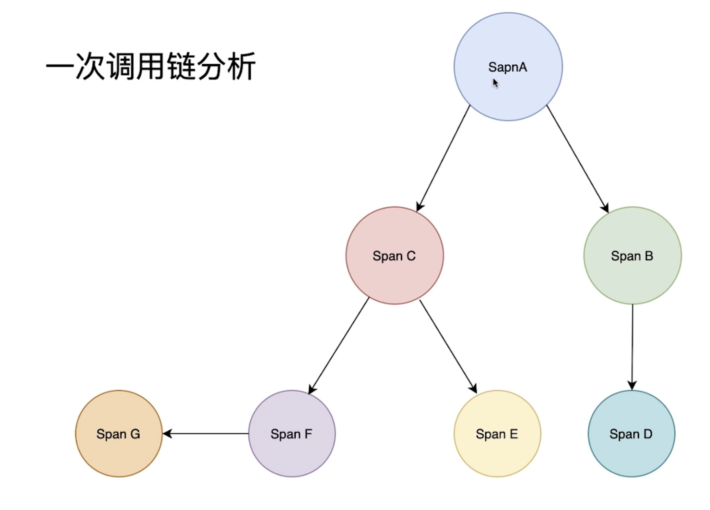
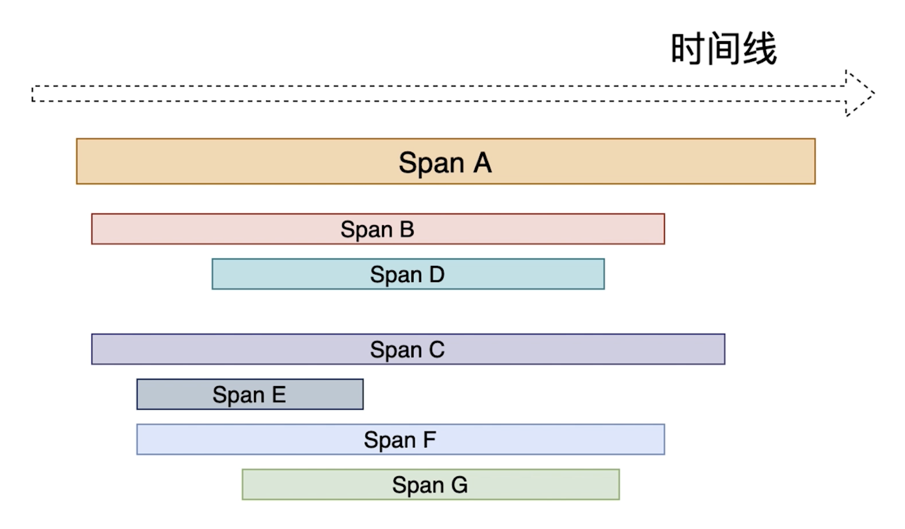
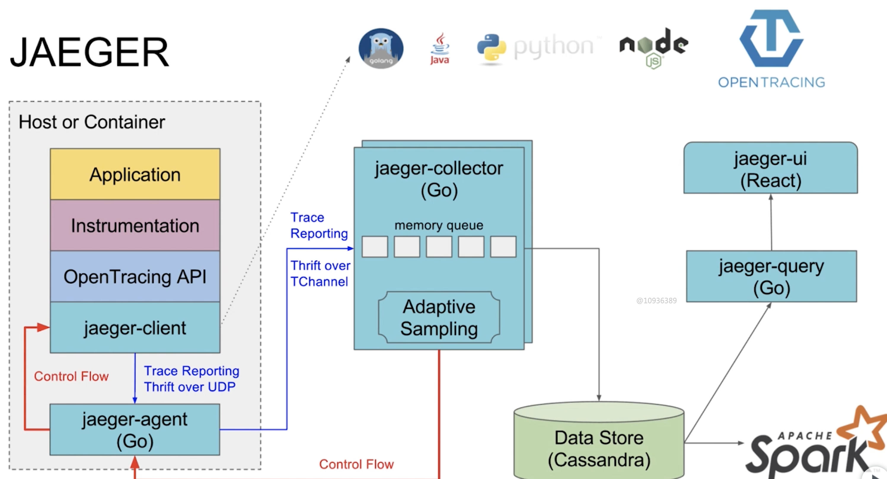
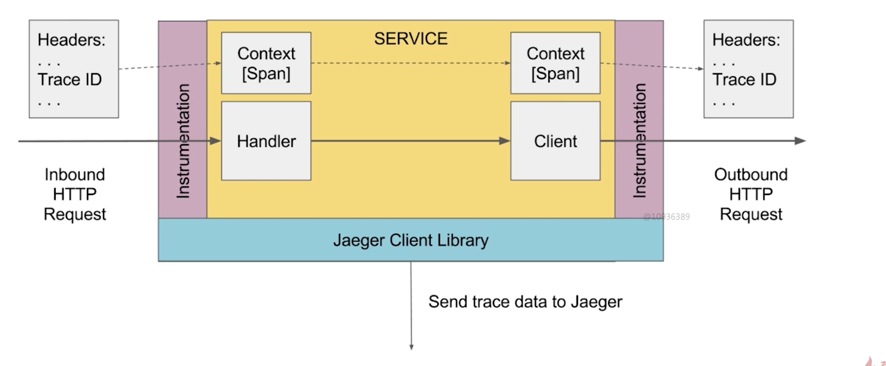
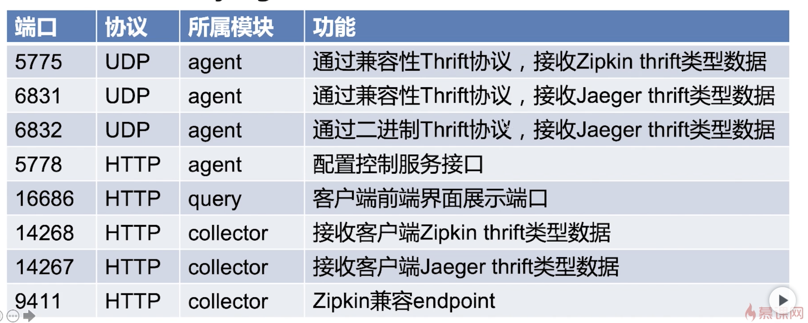
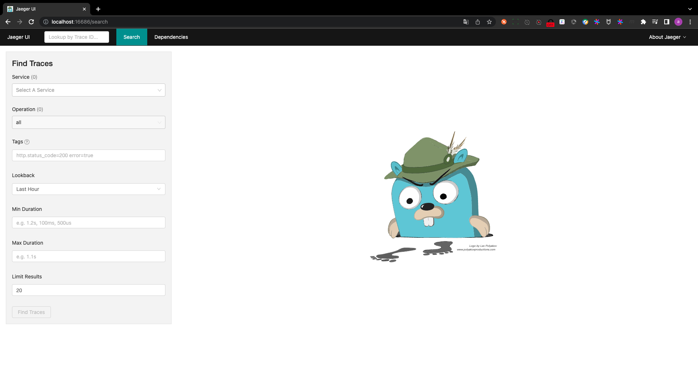

# principle of jaeger

## PART1. 本章主要内容

- 链路追踪的作用与特性
- 链路追踪jaeger术语、原理、组件、安装
- 在代码中使用链路追踪jaeger

## PART2. 微服务链路追踪作用

如果你不能度量它,你就无法改进它--彼得.德鲁克

- 用于监视和诊断基于微服务的分布式系统
- 用于服务依赖性分析,辅助性能优化

## PART3. jaeger的主要特性

- 高扩展性
- 原生支持OpenTracing(一种追踪标准)
- 可观察性

## PART4. jaeger的术语

### 4.1 span

- jaeger中的逻辑工作单元
- 具有操作名称,操作的开始时间和持续时间
- 跨度可以嵌套并排序,以便建立因果关系模型

### 4.2 span包含的对象

- Operation name:操作名称(也称作Span name)
- Start timestamp:起始时间
- Finish timestamp:结束时间
- Span tag:一组K-V构成的Span标签集合.当Span name无法满足需求,还要给该数据打上其他标识时使用.
- Span log:一组Span的日志集合
- Span Context:上下文对象
- References(Span间关系):相关的0-N个Span

## PART5. jaeger调用原理



user请求A -> A需要同时请求B和C -> C同时依赖D和E

jaeger用于记录这个调用关系.





## PART6. jaeger的组件



### 6.1 jaeger-client

client有不同语言的版本.client收集到Trace信息后发送至agent

### 6.2 jaeger-agent

agent是一个守护进程.用于接收client发送的Trace信息,解耦client与collector之间的关系.agent将Trace信息发送至collector

### 6.3 jaeger-collector

用于收集并处理Trace信息.处理完毕后将Trace信息存储至Cassandra(数据库)

### 6.4 jaeger-query

用于查询Cassandra中的Trace信息

### 6.5 jaeger-ui

用于展示Trace信息

### 6.6 jaeger-client原理



## PART7. jaeger端口说明



## PART8. jaeger的安装

### 8.1 安装

```
docker pull cap1573/jaeger
Using default tag: latest
latest: Pulling from cap1573/jaeger
964e5556af89: Pull complete 
c703fd00f473: Pull complete 
Digest: sha256:f33478342e44a6af54ef99a297e5a52ba39ee1ce5dc776d3797632f221b8df2d
Status: Downloaded newer image for cap1573/jaeger:latest
docker.io/cap1573/jaeger:latest
```

### 8.2 运行

```
docker run -d --name jaeger -p 6831:6831/udp -p 16686:16686 cap1573/jaeger
75af8b81f9b145d73cd532f2eb4e21ae12a3b1021895375a3b04ad1083ac88f9
```

```
docker ps
CONTAINER ID   IMAGE            COMMAND                  CREATED         STATUS         PORTS                                                                                       NAMES
75af8b81f9b1   cap1573/jaeger   "/go/bin/standalone-…"   2 minutes ago   Up 2 minutes   5775/udp, 5778/tcp, 6832/udp, 14268/tcp, 0.0.0.0:6831->6831/udp, 0.0.0.0:16686->16686/tcp   jaeger
```




