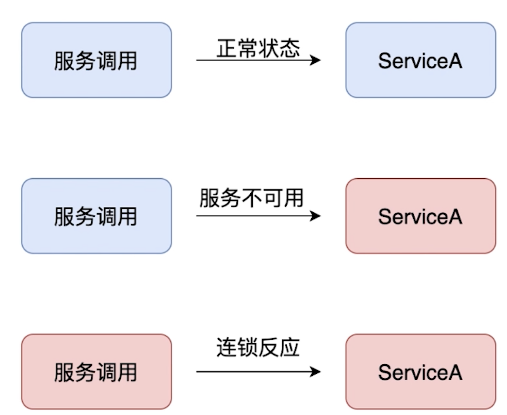

# the effect and principle of hystrix

## PART1. 微服务熔断(hystrix-go)介绍

### 1.1 微服务熔断(hystrix-go)的作用

- 什么是服务雪崩效应?

前提:微服务A调用微服务B,微服务B又需要调用微服务C

当微服务C挂了时,原本微服务B是正常的,但受到了微服务C不可用的影响,导致微服务B也不可用.微服务B的不可用导致微服务A的不可用,产生了一个级联反应.这种情况就叫服务雪崩.



### 1.2 微服务熔断(hystrix-go)的目标

- 阻止故障的连锁反应
- 快速失败并迅速恢复

	- 这里的迅速恢复不是指恢复正常,而是进入熔断的逻辑

- 回退并优雅降级
- 提供近乎实时的监控与告警

### 1.3 微服务熔断(hystrix-go)使用过程中的一些原则

- 防止任何单独的依赖(线程)耗尽资源
- 过载立即切断并快速失败,防止排队
- 尽可能提供回退以保护用户免受故障
- 通过近实时的指标、监控与告警,确保故障被及时发现

## PART2. 微服务熔断(hystrix-go)的请求原理

### 2.1 微服务熔断(hystrix-go)的调用过程


图中:

- 紫色实线为正常逻辑流程
- 黄色虚线为信息上报至计数器流程

1. 熔断是否开启:依赖计数器给出的结果.若熔断已开启则进入callback逻辑
2. 是否超过并发:计数器中记录了设置的最大并发值.QPS超过该值则进入callback逻辑

TODO:若程序逻辑正在执行中,但持续时长已经到达超时时长,是否也会进入callback逻辑?

Answer:熔断是在客户端做的,也就是说客户端自己记录每个请求对应的响应情况(时长、是否成功)等信息.

### 2.2 微服务熔断(hystrix-go)的熔断器状态

- CLOSED:关闭状态.允许流量通过
- OPEN:打开状态.不允许流量通过,即处于降级状态,走降级逻辑
- HALF_OPEN:半开状态.允许某些流量通过,如果出现超时、异常等情况,将进入OPEN状态;如果成功,则进入CLOSED状态

### 2.3 微服务熔断(hystrix-go)的重要配置参数

- Timeout:执行command的超时时间,默认时间1000ms
- MaxConcurrentRequests:最大并发量,默认值10
- SleepWindow:熔断器打开多久后再进行尝试,默认值5000ms
- RequestVolumeThreshold:10s内的请求量.默认值为20,用于判断是否熔断
- ErrorPercentThreshold:熔断百分比.默认值50%.即:在所有的请求中,若异常请求的占比超过该值,则启动熔断

TODO:MaxConcurrentRequests这个最大并发量,是指每秒最多10个请求吗?

### 2.4 微服务熔断(hystrix-go)的熔断计数器

- 每一个Command都会有一个默认统计控制器
- 默认的统计控制器为DefaultMetricController
- 保存熔断器的所有状态,调用次数,失败次数,被拒绝次数等信息

#### 2.4.1 微服务熔断(hystrix-go)的熔断-计数器原理


熔断计数器的窗口大小为10s.每秒有一个bucket,该bucket记录了在这1s内的成功、失败、超时、拒绝的请求次数.当到达第11s时,第1s的bucket将被丢弃.

有一些配置参数的指标是将这10s内的平均值作为判定依据的.

#### 2.4.2 微服务熔断(hystrix-go)的熔断-上报状态信息原理


断路器相当于是一个控制,断路器执行后,计数器开始上报信息,这些bucket信息上报后被写入到熔断器中.熔断器根据bucket信息中的数据判断是否开启熔断.

## PART3. 微服务熔断(hystrix-go)的观测面板安装

```
docker pull cap1573/hystrix-dashboard
Using default tag: latest
latest: Pulling from cap1573/hystrix-dashboard
03e1855d4f31: Pull complete 
a3ed95caeb02: Pull complete 
5b3a2df3e63b: Pull complete 
6ecee6444751: Pull complete 
5b865d39f77d: Pull complete 
e7e5c0273866: Pull complete 
6a4effbc4451: Pull complete 
4b6cb08bb4bc: Pull complete 
7b07ad270e2c: Pull complete 
f03f44139976: Pull complete 
Digest: sha256:31fdfd0abe7517860a2674983f19f10cc412d02a836a4b5ae35bc7798f2f6069
Status: Downloaded newer image for cap1573/hystrix-dashboard:latest
docker.io/cap1573/hystrix-dashboard:latest
```

启动:

```
docker run -d -p 9002:9002 cap1573/hystrix-dashboard
```

