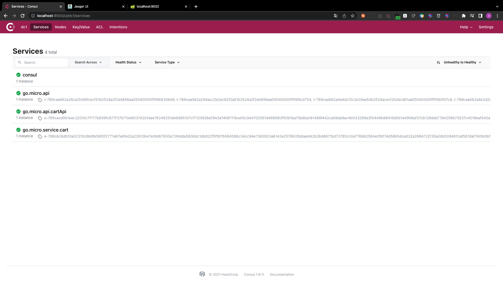
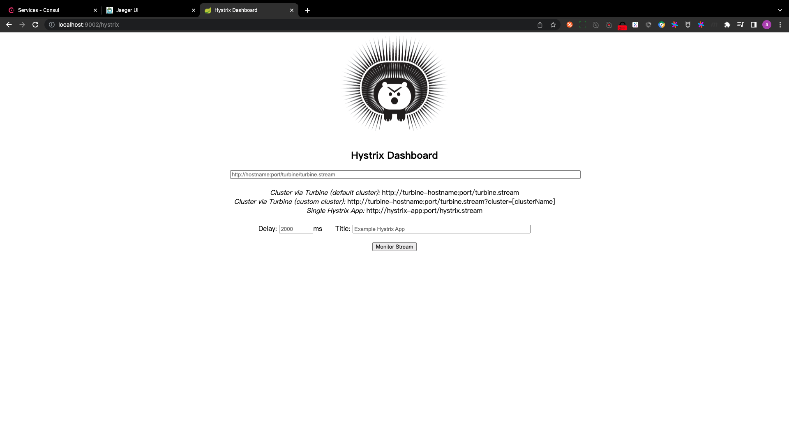
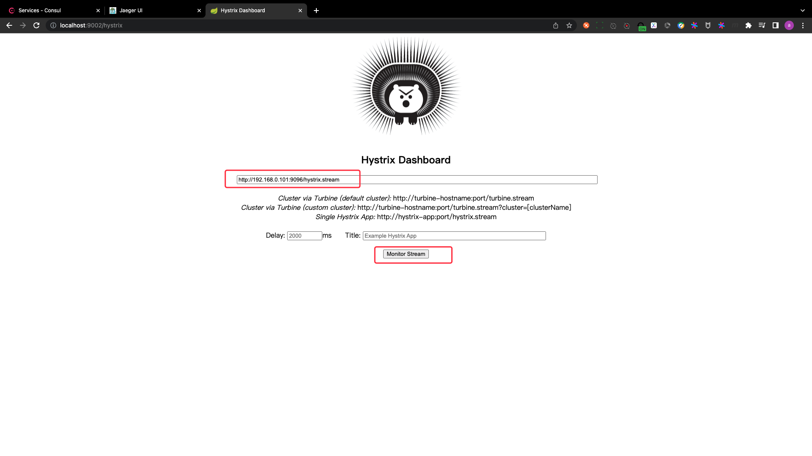
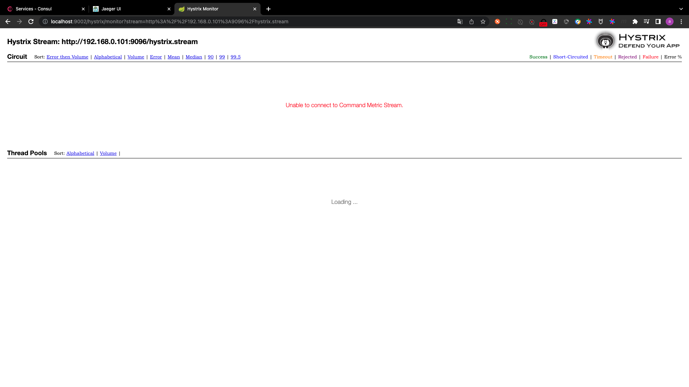
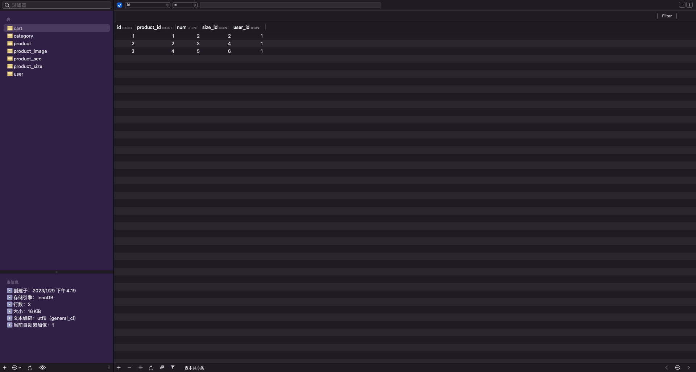
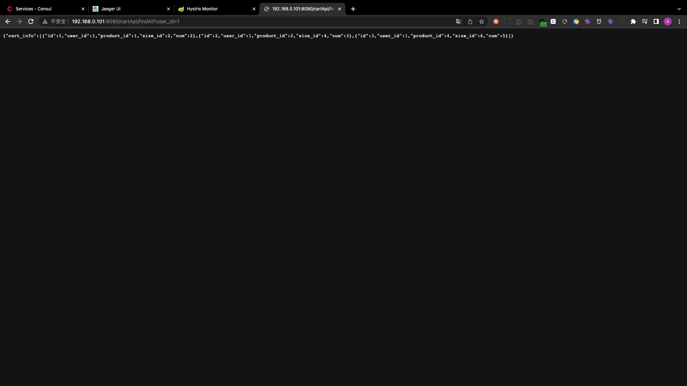
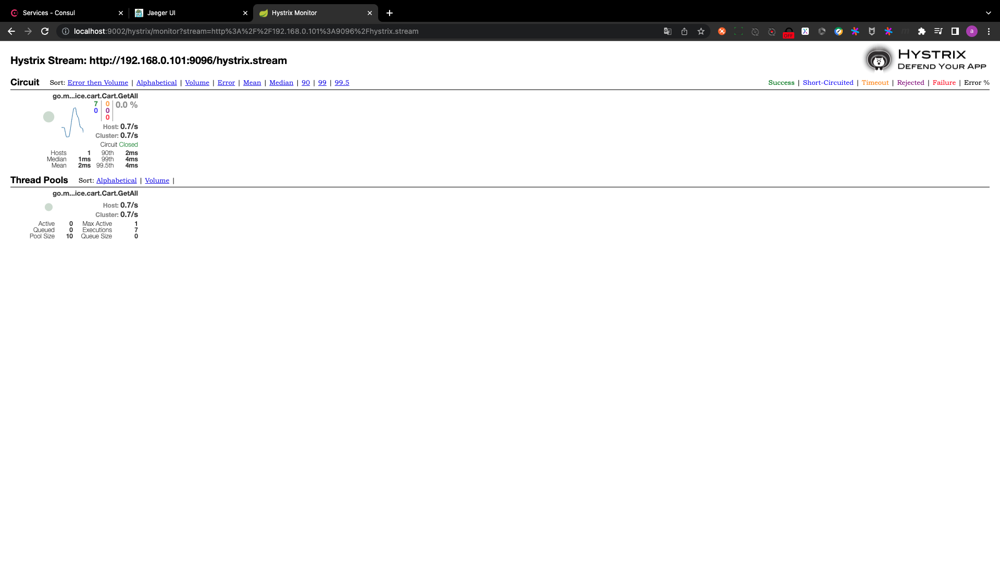

# API Gateway and fuse dashboard

## PART1. 接入网关

- step1. 启动cartApi

- step2. 在cartApi项目的根路径下执行:

`docker run --rm -p 8090:8080 -e ICODE=5A2A1531917A4D2B cap1573/cap-micro --registry=consul --registry_address=192.168.0.101:8500 api --handler=api`

注:192.168.0.101是本机的IP地址.此处由于容器的网络问题,故一定要写本机IP,不能写127.0.0.1

cart基础服务和cartAPI以及网关都启动时consul的状态如下图示:

## PART2. 访问网关

访问`http://localhost:9002/hystrix`即可

注:需事先执行`docker run -d -p 9002:9002 cap1573/hystrix-dashboard`

## PART3. 指定监听的熔断器

在监听的表单处填写:`http://192.168.0.101:9096/hystrix.stream`即可.

注:此处同上,要写容器能访问到的外部地址

## PART4. 访问网关

浏览器中访问`http://192.168.0.101:8090/cartApi/findAll?user_id=1`或`http://127.0.0.1:8090/cartApi/findAll?user_id=1`均可

此处由于2个cartApi相同,故可以省略一个

此时因为DB中没有数据,所以返回的是一个空的JSON.

## PART5. DB中添加数据

## PART6. 再次访问网关

## PART7. 熔断看板

