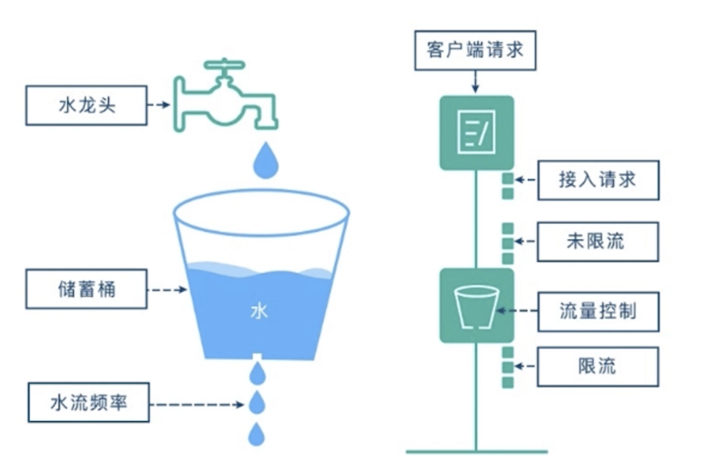

# the effect and principle of current-limiting

## PART1. 限流(uber/limit)的作用

- 限制流量,在服务端生效(熔断是在客户端生效的)
- 保护后端服务
- 与熔断互补

	- 熔断是客户端发现服务端不可用时,迅速让自身进入降级状态;限流是服务端的保护措施

## PART2.	 限流(uber/limit)漏桶算法原理

简单理解:图中的流量控制处类似一个水桶,满足流量控制算法的请求会被放行,不满足流量控制算法的请求则会留在这个桶里