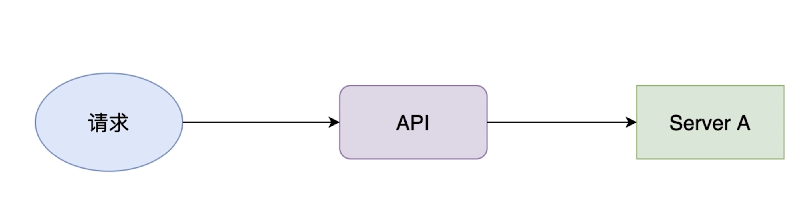
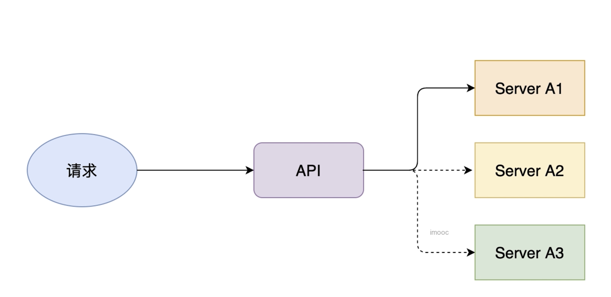

# the effect and principle of load balance

## PART1. 负载均衡的作用

- 提高系统扩展性
- 支持:HTTP、HTTPS、TCP、UDP请求
- 主要算法:循环算法和随机算法,默认随机算法

负载均衡可以做在服务端也可以做在客户端

## PART2. 负载均衡的架构

当ServiceA的压力较大时,将采用负载均衡架构:

ServiceA横向扩展为ServiceA1、ServiceA2和ServiceA3.提高服务端的处理能力.

在本模块中,我们会将负载均衡写在客户端