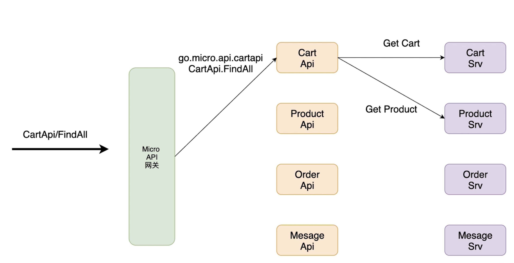

# API gateway of micro service

## PART1. 微服务API网关的总体架构

微服务API网关架构分为3层:

1. API网关层:这一层是不需要开发的,只需启动起来
2. API层:也就是聚合业务层.这一层将基础服务聚合,组装业务逻辑,返回给前端的请求
3. 基础服务层:就是前几章写的service,处理底层基础逻辑,保证服务的单一职责

这样做的好处在于:

1. 分层的架构设计可以提高代码的复用性
2. 越基础的代码越稳定,越稳定则复用性越高.这样也确保了底层服务单一职责
3. 提高扩展性.越是底层的代码,在业务上越需要它稳定,不要经常变更;越是表层的代码,越会随着业务逻辑经常变更调整

## PART2. 微服务API网关的路径说明

- 网关请求`/greeter/say/hello`,则网关会将请求转发到`go.micro.api.greeter`服务的`Say.Hello`方法处理
- `go.micro.api`是网关的默认服务名的前缀
- 路径中`/cartApi/cartApi/findAll`可以简写为`/cartApi/findAll`

