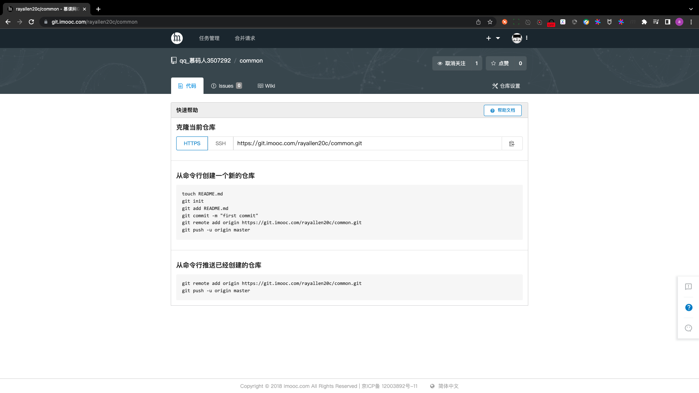

# to be independent common

## PART1. 创建工程目录

- step1. 将common作为一个模块,和user、category、cart同级,单独创建一个工程目录(说人话就是文件夹)

```
 pwd
/common
```

- step2. 创建远程仓库



- step3. 初始化仓库

```
git init
```

- step4. 初始化项目

```
go mod init git.imooc.com/rayallen20c/common
go: creating new go.mod: module git.imooc.com/rayallen20c/common
```

注:此处的`git.imooc.com/rayallen20c/common`,就是step2创建的远程仓库的地址(去掉协议名)

## PART2. 复制文件

- step1. 将之前写过的common目录下的文件复制到上一步的目录中

```
tree ./
./
├── config.go
├── go.mod
├── jaeger.go
├── mysql.go
└── swap.go

0 directories, 5 files
```

- step2. 安装依赖

```
go mod tidy
...
go: found github.com/uber/jaeger-lib/metrics in github.com/uber/jaeger-lib v2.4.1+incompatible
go: found github.com/uber/jaeger-lib/metrics/metricstest in github.com/uber/jaeger-lib v2.4.1+incompatible
go: finding module for package github.com/HdrHistogram/hdrhistogram-go
go: found github.com/HdrHistogram/hdrhistogram-go in github.com/HdrHistogram/hdrhistogram-go v1.1.2
go: downloading github.com/google/go-cmp v0.5.4
```

## PART3. 推送代码至远端仓库

```
git add .
git commit -m "common独立模块化开发完成"
git push https://用户名:密码@git.imooc.com/rayallen20c/common.git --all
```