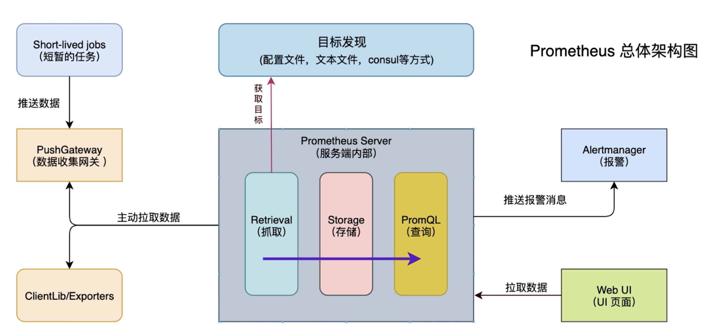

# introduce of prometheus

## PART1. 本章主要内容

本章主要内容:

- 监控系统介绍
- docker-compose的使用
- 订单服务开发

本章主要内容为GO微服务性能监控能力建设.

## PART2. 微服务监控系统prometheus引入

### 2.1 监控的基本概念

- 是一套开源的监控、报警、时序数据库的组合
- 基本原理是通过HTTP协议周期性抓取被监控组件的状态
- 适合Docker、Kubernetes环境的监控系统

### 2.2 监控系统工作原理



### 2.2.1 prometheus重要组件

- Prometheus Server:用于收集和存储时间序列数据
- Client Library:客户端库生成相应的metrics并暴露给Prometheus Server
- Push Gateway:主要用于短期jobs
- Exporters:用于暴露已有的第三方服务的metrics给Prometheus Server
- Alertmanager:从Prometheus Server端接收到alerts后,会进行去重、分组,并路由到对应的接收方式,发出报警

### 2.2.2 prometheus工作流程

- Prometheus Server定期从配置好的jobs/exporters/Push Gateway中拉取数据
- Prometheus Server记录数据并根据报警规则推送alert数据
- Alertmanager根据配置文件,对接收到的警报进行处理,发出告警
- 在图形界面中,可视化采集数据

### 2.2.3 prometheus数据模型

- Prometheus中存储的数据为时间序列
- 格式上有metric的名字和一系列的标签(键值对)唯一标识组成
- 不同的标签表示不同的时间序列

#### a. metric(指标)类型

- Counter类型:一种累加型指标.如:请求的个数,出现的错误数等
- Gauge类型:可以任意加减.如:温度,运行的goroutines个数
- Histogram类型:对观察结果采样、分组和统计.如:柱状图
- Summary类型:提供观测值的count和sum功能.如:请求持续时间

#### b. instance

- instance:一个单独监控的目标,一般对应于一个进程

#### c. jobs

- jobs:一组同种类型的instances(主要用于保证可扩展性和可靠性)

### 2.2.4 grafana看板

- 丰富的dashboard和图表编辑的指标分析平台
- 有权限管理和用户管理系统
- 更适用于数据可视化展示

### 2.3 监控系统安装

此处使用的是成品镜像.

`docker pull cap1573/grafana`

```
docker pull cap1573/grafana
Using default tag: latest
latest: Pulling from cap1573/grafana
df20fa9351a1: Already exists 
b11b8ee53603: Pull complete 
22421a0ae04e: Pull complete 
d79f05d0adf8: Pull complete 
89356a38ff16: Pull complete 
c426715e26bf: Pull complete 
Digest: sha256:b90de84f06c2fae1fba4e16d8405cd860f50bc769d6e6a54bc991e5d547e4fa3
Status: Downloaded newer image for cap1573/grafana:latest
docker.io/cap1573/grafana:latest
```

`docker pull cap1573/prometheus`

```
docker pull cap1573/prometheus
Using default tag: latest
latest: Pulling from cap1573/prometheus
76df9210b28c: Pull complete 
559be8e06c14: Pull complete 
97170ed2e56a: Pull complete 
4a6c0b5646ca: Pull complete 
f6776fcc9f18: Pull complete 
7eed139cfec6: Pull complete 
c0c3c15c8e94: Pull complete 
ad6e678f5b25: Pull complete 
9a8236411762: Pull complete 
0cfb39b876cc: Pull complete 
ffe345581c7a: Pull complete 
033c1a7f7349: Pull complete 
Digest: sha256:e7d566a59b2882364b946ba2b3791bfbf60d86ecf5ecb73d81d836a3a0ae5240
Status: Downloaded newer image for cap1573/prometheus:latest
docker.io/cap1573/prometheus:latest
```

此处后续使用docker-compose编排容器.
