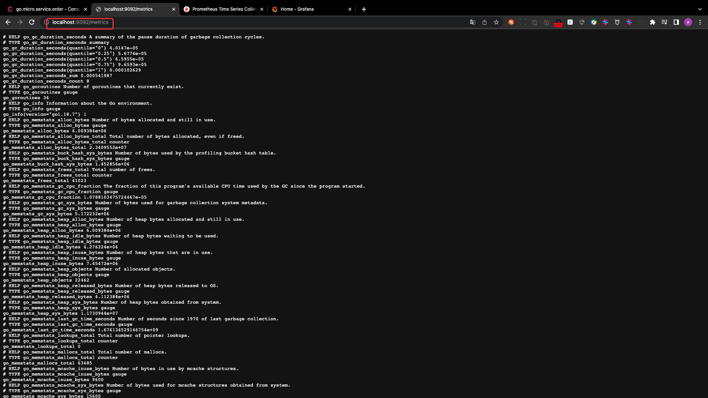
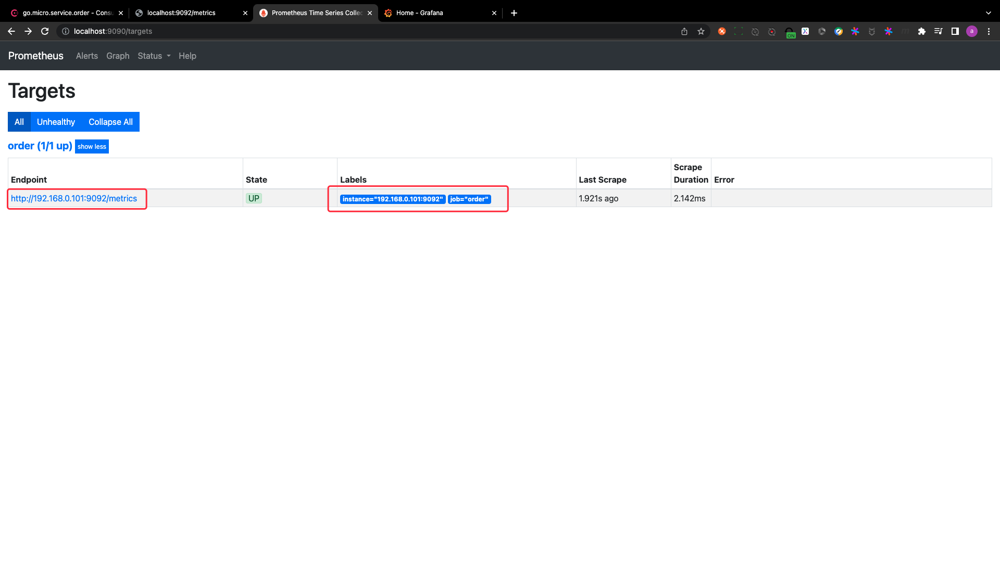
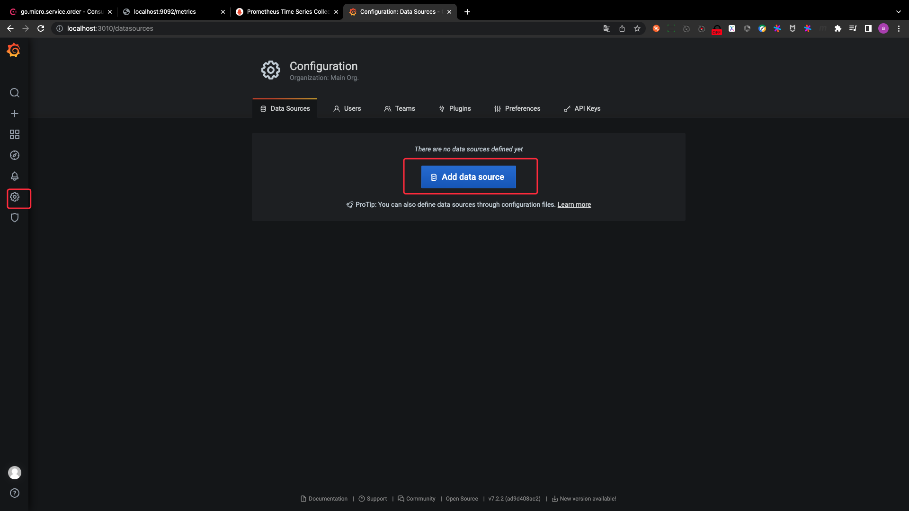
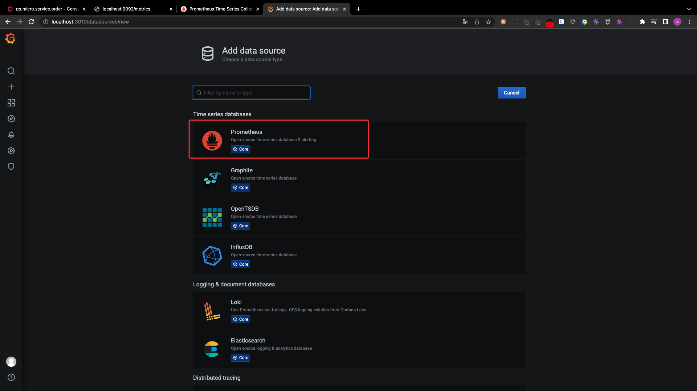
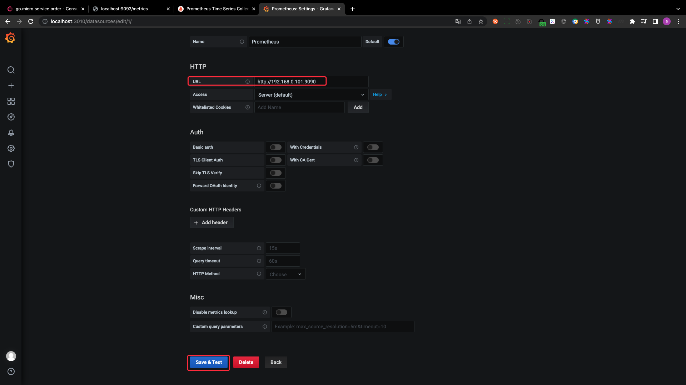
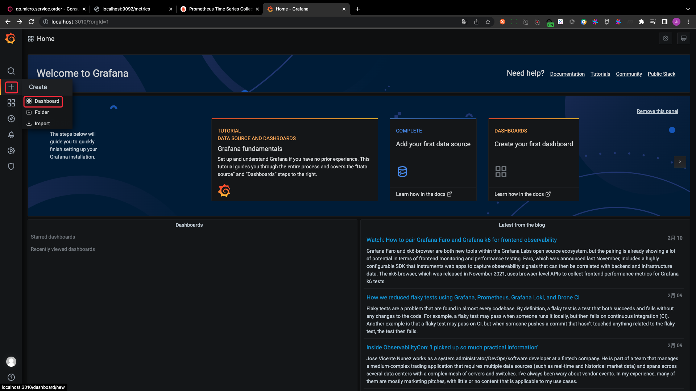
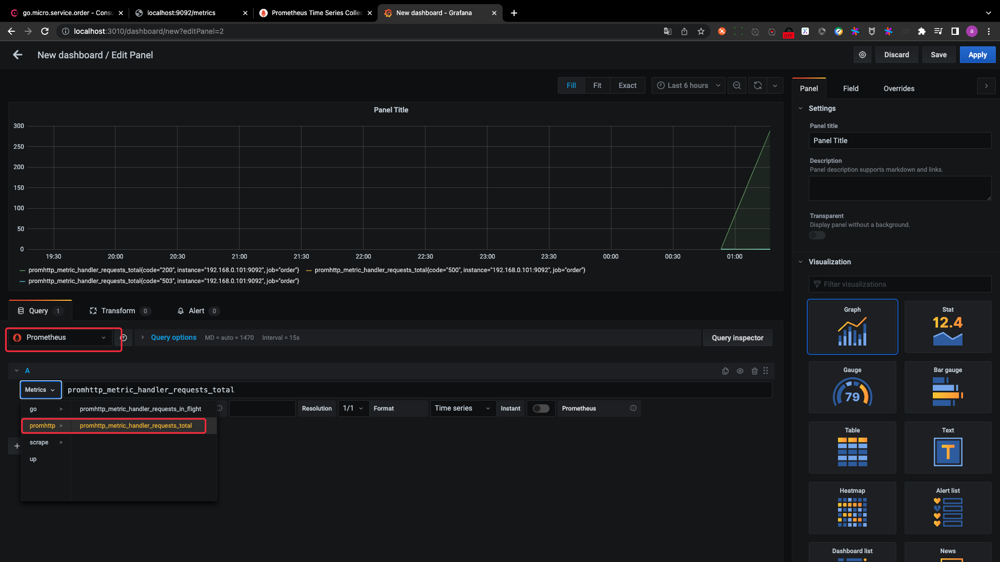

# monitoring system visualization

## PART1. 编写`docker-compose.yml`

```yaml
# 声明版本
version: "3"
# 定义服务 这些服务可以在同一个网络内进行访问
services:
  # 注册中心 与 配置中心
  consul:
    # 指定使用的镜像
    image: cap1573/consul:latest
    # 指定端口映射
    ports:
      # 宿主机端口:容器
      - "8500:8500"
  # 链路追踪
  jaeger:
    image: cap1573/jaeger:latest
    ports:
      - "6831:6831/udp"
      - "16686:16686"
  # 熔断器
  hystrix-dashboard:
    image: cap1573/hystrix-dashboard
    ports:
      - "9002:9002"
  # prometheus监控
  prometheus:
    image: cap1573/prometheus
    volumes:
      - ./prometheus.yml:/etc/prometheus/prometheus.yml
    ports:
      - "9090:9090"
  # grafana看板
  grafana:
    image: cap1573/grafana
    ports:
      - "3010:3000"
```

## PART2. 编写prometheus的配置文件`prometheus.yml`

```yaml
global:
  # 2次采集的间隔时间
  scrape_interval: 15s
  # 全局配置额外的标签
  external_labels:
    monitor: 'go-micro-monitor'

# 监控任务相关配置
scrape_configs:
  # 监控任务的名称
  - job_name: 'order'
    # 采集间隔时间
    scrape_interval: 5s
    static_configs:
      # metrics地址
      - targets: ['192.168.0.101:9092']
```

## PART3. 启动容器

`docker-compose up -f docker-compose.yml up -d`即可

## PART4. 启动后的效果

注:此处需将order微服务先运行起来

metrics页面:



prometheus监控的targets



grafana配置数据源-1



grafana配置数据源-2



grafana配置数据源-3



创建看板-1



创建看板-2

