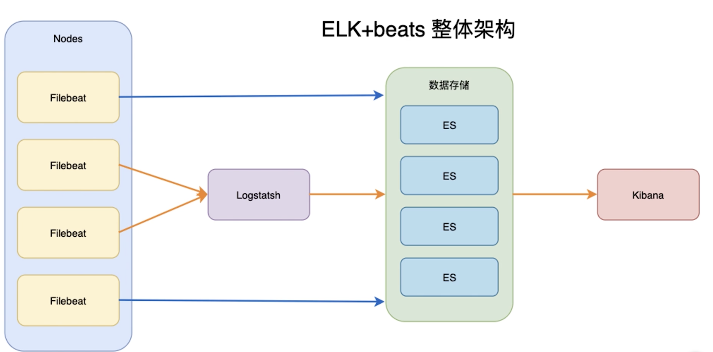

# introduction of ELK

## PART1. GO微服务日志系统建立

本章主要内容:

- 日志系统ELK介绍
- 国际支付PayPal沙盒环境创建
- 支付领域功能开发

### 1.1 为什么需要日志系统

- 业务发展越来越庞大,服务器越来越多
- 各种访问日志、应用日志、错误日志越来越多,无法管理
- 开发人员排查问题,需要到服务器上查看日志

### 1.2 什么是Elastic Stack(Elasticsearch, Logstash, Kibana, Beats)

- Elasticsearch:分布式搜索引擎,提供搜集、分析存储数据三大功能
- Logstash:用于日志的搜集、分析、过滤日志
- Kibana:提供友好的Web界面,可以帮助汇总、分析和搜索数据
- Beats:是一个轻量级的日志收集处理工具(Agent)

### 1.3 Beats的6种主要工具

- Packetbeat:网络数据(收集网络流量数据)
- Metricbeat:指标(收集系统、进程和文件系统级别数据)
- Filebeat:日志文件(收集文件数据)
- Winlogbeat:windows事件日志(收集windows事件日志数据)
- Auditbeat:审计数据(收集审计日志)
- Heartbeat:运行时间监控(收集系统运行时的数据)

## PART2. ELK系统的特点

- 强大的收集能力:能够采集多种来源的日志数据
- 稳定的传输能力:能够把日志数据传输到中央系统
- 分布式存储:可根据业务需求存储日志数据,可动态扩容
- 分析&展示&提醒:具备数据分析能力,数据展示能力和告警能力

## PART3. ELK+beats整体架构

