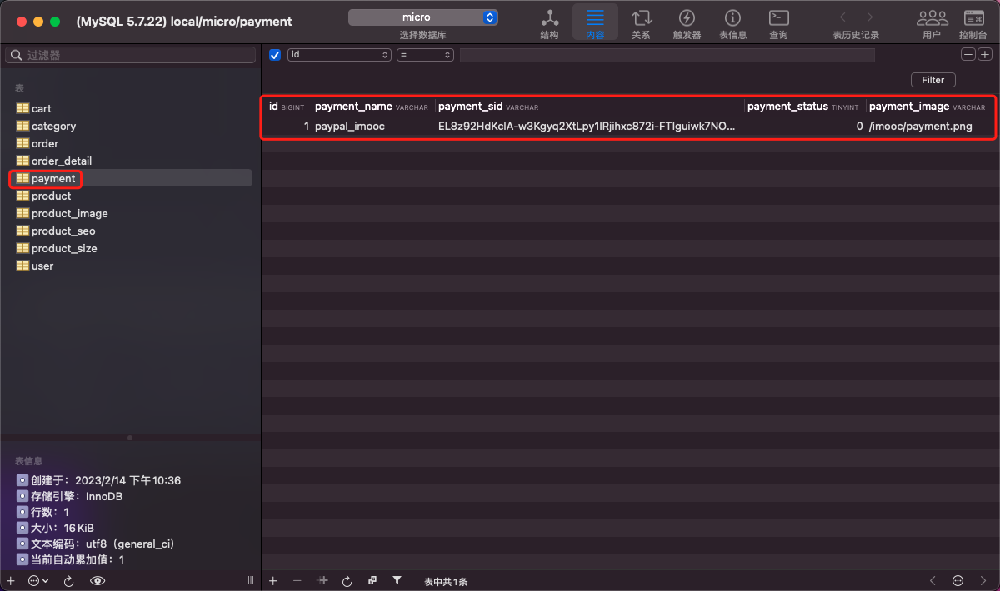

# develop handler of paymentApi--first half

## PART1. 拉取依赖

`go get github.com/rayallen20/payment`

## PART2. 向DB中插入数据



其中`payment_sid`即为paypal sandbox app中的secret

## PART3. 参数验证

`paymentApi/handler/paymentApi.go`:

```go
package handler

import (
	"context"
	"errors"
	"github.com/rayallen20/common"
	go_micro_service_payment "github.com/rayallen20/payment/proto/payment"
	paymentApi "github.com/rayallen20/paymentApi/proto/paymentApi"
)

type PaymentApi struct {
	PaymentService go_micro_service_payment.PaymentService
}

var (
	// ClientID PayPal的sandbox app的id
	ClientID string = "AVKXYfKLOTMmueeQeQeDH5skLWbEgelOJYMYUOtkI97wm6n178zc6SUUpWScMC4y4cilrGrD8mxWSaMh"
)

// PayPalRefund PaymentApi.PayPalRefund 通过API向外暴露为/paymentApi/payPalRefund，接收http请求
// 即：/paymentApi/payPalRefund请求会调用go.micro.api.paymentApi 服务的PaymentApi.PayPalRefund方法
// 退款业务逻辑
func (e *PaymentApi) PayPalRefund(ctx context.Context, req *paymentApi.Request, rsp *paymentApi.Response) error {
	//验证payment支付通道是否赋值
	if err := isOK("payment_id", req); err != nil {
		rsp.StatusCode = 500
		return err
	}

	//验证退款号
	if err := isOK("refund_id", req); err != nil {
		rsp.StatusCode = 500
		return err
	}

	//验证退款金额
	if err := isOK("money", req); err != nil {
		rsp.StatusCode = 500
		return err
	}
}

// isOK 根据给定的key名 判断该key在请求中是否存在
func isOK(key string, req *paymentApi.Request) error {
	if _, ok := req.Get[key]; !ok {
		err := errors.New(key + " 参数异常")
		common.Error(err)
		return err
	}
	return nil
}
```

## PART4. 获取paymentID与支付通道信息

### 4.1 获取paymentID

`paymentApi/handler/paymentApi.go`:

```go
package handler

import (
	"context"
	"errors"
	"github.com/rayallen20/common"
	go_micro_service_payment "github.com/rayallen20/payment/proto/payment"
	paymentApi "github.com/rayallen20/paymentApi/proto/paymentApi"
	"strconv"
)

type PaymentApi struct {
	PaymentService go_micro_service_payment.PaymentService
}

var (
	// ClientID PayPal的sandbox app的id
	ClientID string = "AVKXYfKLOTMmueeQeQeDH5skLWbEgelOJYMYUOtkI97wm6n178zc6SUUpWScMC4y4cilrGrD8mxWSaMh"
)

// PayPalRefund PaymentApi.PayPalRefund 通过API向外暴露为/paymentApi/payPalRefund，接收http请求
// 即：/paymentApi/payPalRefund请求会调用go.micro.api.paymentApi 服务的PaymentApi.PayPalRefund方法
// 退款业务逻辑
func (e *PaymentApi) PayPalRefund(ctx context.Context, req *paymentApi.Request, rsp *paymentApi.Response) error {
	//验证payment支付通道是否赋值
	if err := isOK("payment_id", req); err != nil {
		rsp.StatusCode = 500
		return err
	}

	//验证退款号
	if err := isOK("refund_id", req); err != nil {
		rsp.StatusCode = 500
		return err
	}

	//验证退款金额
	if err := isOK("money", req); err != nil {
		rsp.StatusCode = 500
		return err
	}

	// 获取paymentID
	paymentID, err := strconv.ParseInt(req.Get["payment_id"].Values[0], 10, 64)
	if err != nil {
		common.Error(err)
		return err
	}
}

// isOK 根据给定的key名 判断该key在请求中是否存在
func isOK(key string, req *paymentApi.Request) error {
	if _, ok := req.Get[key]; !ok {
		err := errors.New(key + " 参数异常")
		common.Error(err)
		return err
	}
	return nil
}
```

### 4.2 获取支付通道信息

`paymentApi/handler/paymentApi.go`:

```go
package handler

import (
	"context"
	"errors"
	"github.com/rayallen20/common"
	go_micro_service_payment "github.com/rayallen20/payment/proto/payment"
	paymentApi "github.com/rayallen20/paymentApi/proto/paymentApi"
	"strconv"
)

type PaymentApi struct {
	PaymentService go_micro_service_payment.PaymentService
}

var (
	// ClientID PayPal的sandbox app的id
	ClientID string = "AVKXYfKLOTMmueeQeQeDH5skLWbEgelOJYMYUOtkI97wm6n178zc6SUUpWScMC4y4cilrGrD8mxWSaMh"
)

// PayPalRefund PaymentApi.PayPalRefund 通过API向外暴露为/paymentApi/payPalRefund，接收http请求
// 即：/paymentApi/payPalRefund请求会调用go.micro.api.paymentApi 服务的PaymentApi.PayPalRefund方法
// 退款业务逻辑
func (e *PaymentApi) PayPalRefund(ctx context.Context, req *paymentApi.Request, rsp *paymentApi.Response) error {
	//验证payment支付通道是否赋值
	if err := isOK("payment_id", req); err != nil {
		rsp.StatusCode = 500
		return err
	}

	//验证退款号
	if err := isOK("refund_id", req); err != nil {
		rsp.StatusCode = 500
		return err
	}

	//验证退款金额
	if err := isOK("money", req); err != nil {
		rsp.StatusCode = 500
		return err
	}

	// 获取paymentID
	paymentID, err := strconv.ParseInt(req.Get["payment_id"].Values[0], 10, 64)
	if err != nil {
		common.Error(err)
		return err
	}

	// 获取支付通道信息
	paymentInfo, err := e.PaymentService.FindPaymentByID(ctx, &go_micro_service_payment.PaymentID{PaymentId: paymentID})
	if err != nil {
		common.Error(err)
		return err
	}
}

// isOK 根据给定的key名 判断该key在请求中是否存在
func isOK(key string, req *paymentApi.Request) error {
	if _, ok := req.Get[key]; !ok {
		err := errors.New(key + " 参数异常")
		common.Error(err)
		return err
	}
	return nil
}
```

## PART5. 确认支付模式

拉取依赖:`github.com/plutov/paypal/v3`

`paymentApi/handler/paymentApi.go`:

```go
package handler

import (
	"context"
	"errors"
	"github.com/plutov/paypal/v3"
	"github.com/rayallen20/common"
	go_micro_service_payment "github.com/rayallen20/payment/proto/payment"
	paymentApi "github.com/rayallen20/paymentApi/proto/paymentApi"
	"strconv"
)

type PaymentApi struct {
	PaymentService go_micro_service_payment.PaymentService
}

var (
	// ClientID PayPal的sandbox app的id
	ClientID string = "AVKXYfKLOTMmueeQeQeDH5skLWbEgelOJYMYUOtkI97wm6n178zc6SUUpWScMC4y4cilrGrD8mxWSaMh"
)

// PayPalRefund PaymentApi.PayPalRefund 通过API向外暴露为/paymentApi/payPalRefund，接收http请求
// 即：/paymentApi/payPalRefund请求会调用go.micro.api.paymentApi 服务的PaymentApi.PayPalRefund方法
// 退款业务逻辑
func (e *PaymentApi) PayPalRefund(ctx context.Context, req *paymentApi.Request, rsp *paymentApi.Response) error {
	//验证payment支付通道是否赋值
	if err := isOK("payment_id", req); err != nil {
		rsp.StatusCode = 500
		return err
	}

	//验证退款号
	if err := isOK("refund_id", req); err != nil {
		rsp.StatusCode = 500
		return err
	}

	//验证退款金额
	if err := isOK("money", req); err != nil {
		rsp.StatusCode = 500
		return err
	}

	// 获取paymentID
	paymentID, err := strconv.ParseInt(req.Get["payment_id"].Values[0], 10, 64)
	if err != nil {
		common.Error(err)
		return err
	}

	// 获取支付通道信息
	paymentInfo, err := e.PaymentService.FindPaymentByID(ctx, &go_micro_service_payment.PaymentID{PaymentId: paymentID})
	if err != nil {
		common.Error(err)
		return err
	}

	// 确认支付模式
	status := paypal.APIBaseSandBox
	// 若DB中记录为生产环境 则将status置为生产环境
	if paymentInfo.PaymentStatus {
		status = paypal.APIBaseLive
	}
}

// isOK 根据给定的key名 判断该key在请求中是否存在
func isOK(key string, req *paymentApi.Request) error {
	if _, ok := req.Get[key]; !ok {
		err := errors.New(key + " 参数异常")
		common.Error(err)
		return err
	}
	return nil
}
```