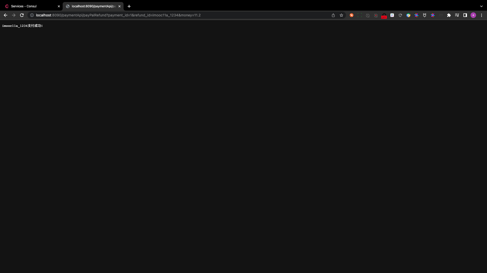
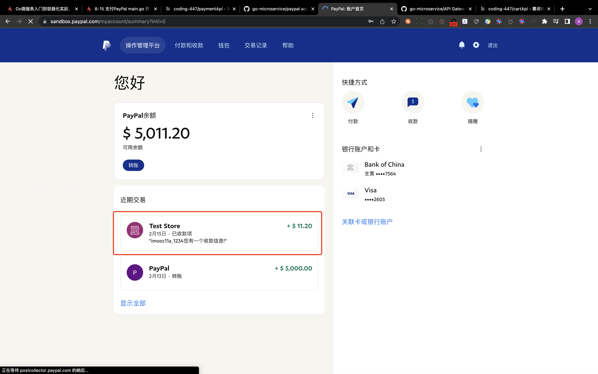
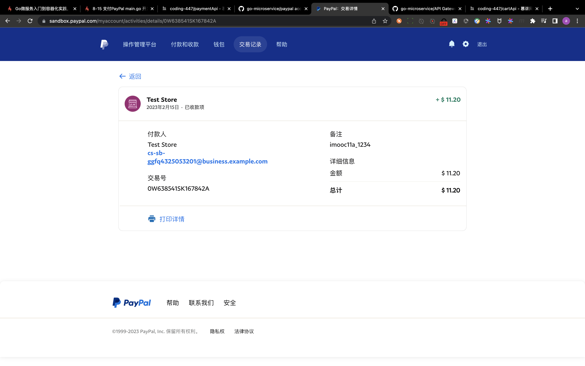

# develop main--second half

## PART1. 启动网关

paymentApi和payment都启动起来之后,启动网关:

`docker run --rm -p 8090:8080 -e ICODE=5A2A1531917A4D2B cap1573/cap-micro --registry=consul --registry_address=192.168.0.101:8500 api --handler=api`

## PART2. 访问

`http://localhost:8090/paymentApi/payPalRefund?payment_id=1&refund_id=imooc11a_1234&money=11.2`

其中:

- `payment_id`是DB中手工输入的那条记录的id值
- `refund_id`在每个请求之间唯一
- `money`:随便写

## PART3. 确认

登录[沙箱账号登录地址](https://www.sandbox.paypal.com/),使用personal的沙箱账户登录.

