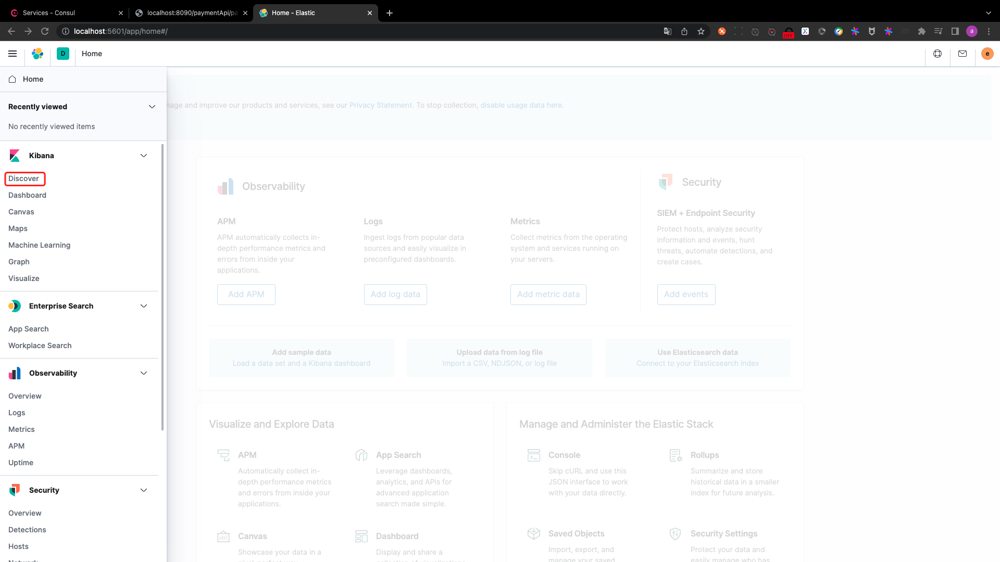
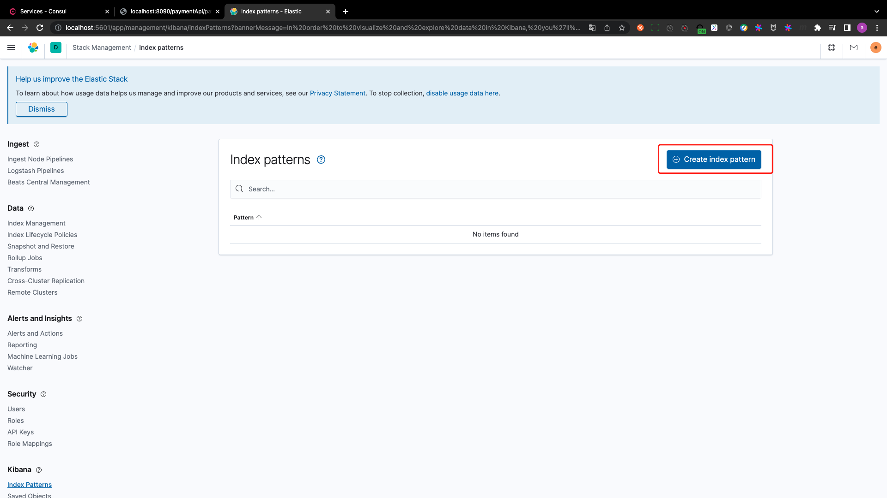
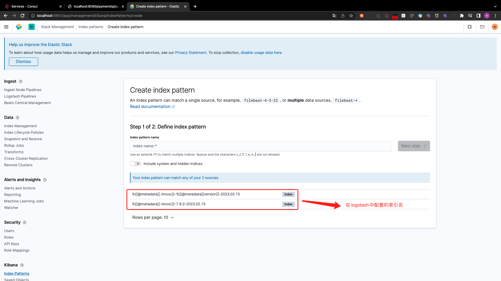
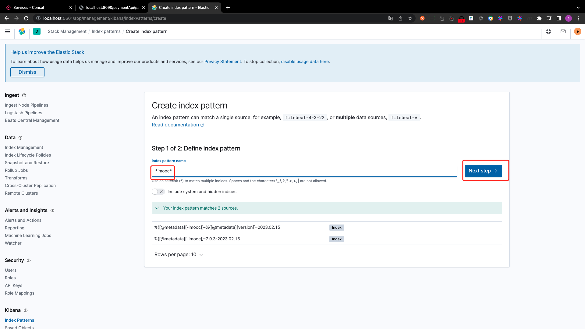
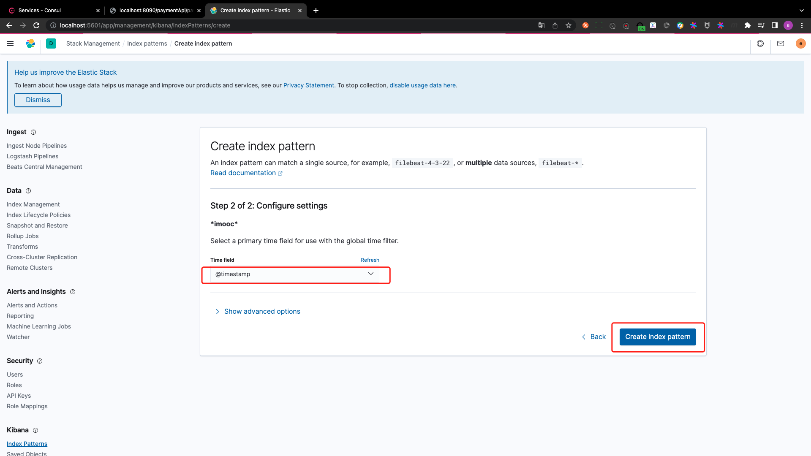
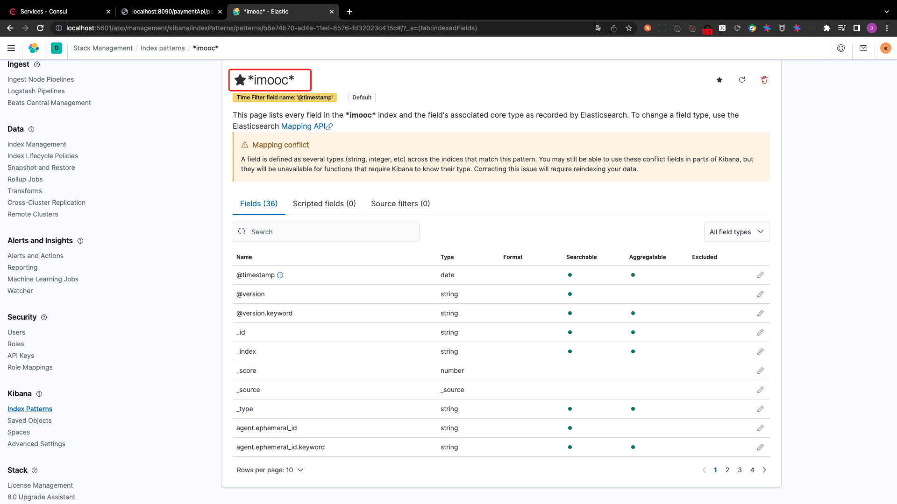
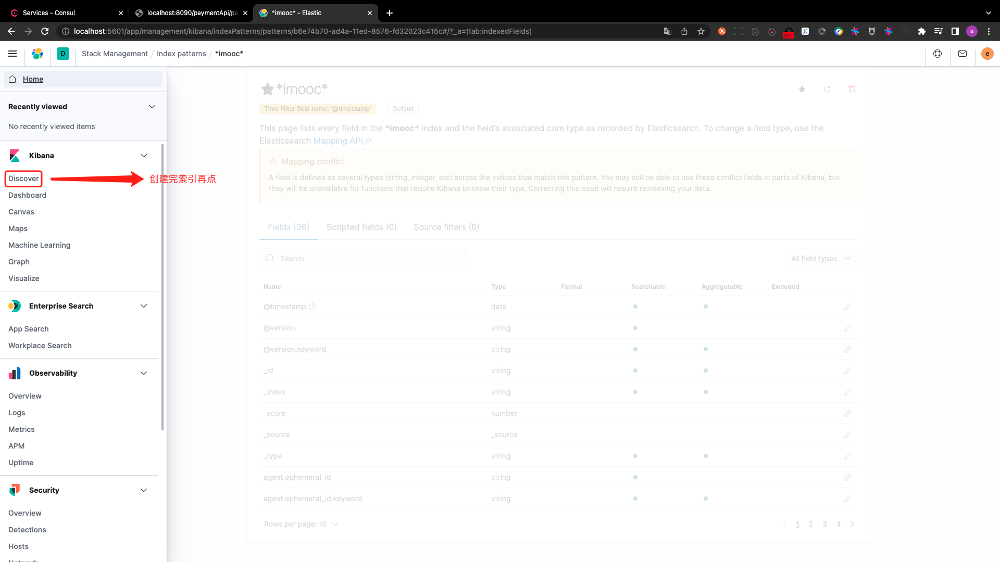
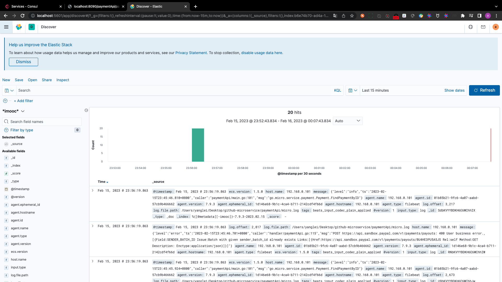

# use kibana to display log

## PART1. 配置filebeat

将网关、paymentApi、payment都启动.

由于之前访问过几次,故`paymentApi/micro.log`内容如下:

```
{"level":"info","ts":"2023-02-15T23:15:09.387+0800","caller":"paymentApi/main.go:101","msg":"go.micro.service.payment.Payment.FindPaymentByID"}
{"level":"info","ts":"2023-02-15T23:15:11.938+0800","caller":"handler/paymentApi.go:118","msg":"&{0xc00013e000 [] [{https://api.sandbox.paypal.com/v1/payments/payouts/BU4HE3PU5A5JS self GET  application/json}]}"}
{"level":"error","ts":"2023-02-15T23:19:58.779+0800","caller":"handler/paymentApi.go:127","msg":"payment_id 参数异常"}
{"level":"error","ts":"2023-02-15T23:19:58.887+0800","caller":"handler/paymentApi.go:127","msg":"payment_id 参数异常"}
{"level":"error","ts":"2023-02-15T23:20:28.517+0800","caller":"handler/paymentApi.go:127","msg":"payment_id 参数异常"}
{"level":"error","ts":"2023-02-15T23:20:28.629+0800","caller":"handler/paymentApi.go:127","msg":"payment_id 参数异常"}
{"level":"error","ts":"2023-02-15T23:20:35.100+0800","caller":"handler/paymentApi.go:127","msg":"payment_id 参数异常"}
{"level":"error","ts":"2023-02-15T23:20:35.206+0800","caller":"handler/paymentApi.go:127","msg":"payment_id 参数异常"}
{"level":"error","ts":"2023-02-15T23:20:46.692+0800","caller":"handler/paymentApi.go:127","msg":"payment_id 参数异常"}
{"level":"error","ts":"2023-02-15T23:20:46.798+0800","caller":"handler/paymentApi.go:127","msg":"payment_id 参数异常"}
{"level":"error","ts":"2023-02-15T23:21:03.973+0800","caller":"handler/paymentApi.go:127","msg":"refund_id 参数异常"}
{"level":"error","ts":"2023-02-15T23:21:04.079+0800","caller":"handler/paymentApi.go:127","msg":"refund_id 参数异常"}
{"level":"info","ts":"2023-02-15T23:45:40.127+0800","caller":"paymentApi/main.go:101","msg":"go.micro.service.payment.Payment.FindPaymentByID"}
{"level":"error","ts":"2023-02-15T23:45:41.990+0800","caller":"handler/paymentApi.go:115","msg":"POST https://api.sandbox.paypal.com/v1/payments/payouts: 400 User business error., [{Field:SENDER_BATCH_ID Issue:Batch with given sender_batch_id already exists Links:[{Href:https://api.sandbox.paypal.com/v1/payments/payouts/BU4HE3PU5A5JS Rel:self Method:GET Description: Enctype:application/json}]}]"}
{"level":"info","ts":"2023-02-15T23:45:42.094+0800","caller":"paymentApi/main.go:101","msg":"go.micro.service.payment.Payment.FindPaymentByID"}
{"level":"error","ts":"2023-02-15T23:45:42.912+0800","caller":"handler/paymentApi.go:115","msg":"POST https://api.sandbox.paypal.com/v1/payments/payouts: 400 User business error., [{Field:SENDER_BATCH_ID Issue:Batch with given sender_batch_id already exists Links:[{Href:https://api.sandbox.paypal.com/v1/payments/payouts/BU4HE3PU5A5JS Rel:self Method:GET Description: Enctype:application/json}]}]"}
{"level":"info","ts":"2023-02-15T23:45:45.924+0800","caller":"paymentApi/main.go:101","msg":"go.micro.service.payment.Payment.FindPaymentByID"}
{"level":"error","ts":"2023-02-15T23:45:46.701+0800","caller":"handler/paymentApi.go:115","msg":"POST https://api.sandbox.paypal.com/v1/payments/payouts: 400 User business error., [{Field:SENDER_BATCH_ID Issue:Batch with given sender_batch_id already exists Links:[{Href:https://api.sandbox.paypal.com/v1/payments/payouts/BU4HE3PU5A5JS Rel:self Method:GET Description: Enctype:application/json}]}]"}
{"level":"info","ts":"2023-02-15T23:45:46.810+0800","caller":"paymentApi/main.go:101","msg":"go.micro.service.payment.Payment.FindPaymentByID"}
{"level":"error","ts":"2023-02-15T23:45:47.583+0800","caller":"handler/paymentApi.go:115","msg":"POST https://api.sandbox.paypal.com/v1/payments/payouts: 400 User business error., [{Field:SENDER_BATCH_ID Issue:Batch with given sender_batch_id already exists Links:[{Href:https://api.sandbox.paypal.com/v1/payments/payouts/BU4HE3PU5A5JS Rel:self Method:GET Description: Enctype:application/json}]}]"}
```

`filebeat.yml`内容如下:

```yaml
# 输入
filebeat.inputs:
  # 输入类型
  - type: log
    enabled: true
    # 抓取路径
    paths: 
      - paymentApi项目根路径/*.log

# 输出
output.logstash:
  # logstash的地址
  hosts: ["localhost:5044"]
```

启动filebeat:

`./filebeat -e -c filebeat.yml`

- `-e`:在终端输出
- `-c`:指定配置文件

## PART2. 使用kibana配置日志索引

注:kibana需要先登录.

- 用户名:elastic
- 密码:imoocpwd















