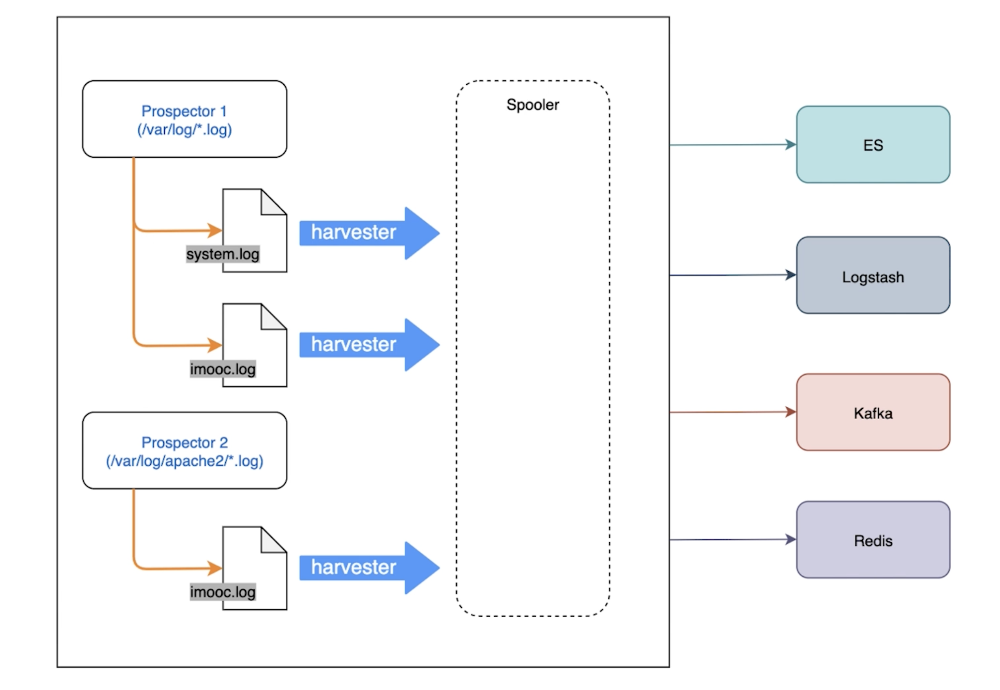

# working principle and attention of Filebeat

## PART1. Filebeat基本组成

- Prospector(勘测者):负责管理Harvester并找到所有读取源
- Harvester(收割机):负责读取单个文件内容,每个文件启动一个

## PART2. Filebeat工作原理



## PART3. Filebeat如何记录文件状态

- 文件状态记录在文件中(`var/lib/filebeat/registry`)
- Filebeat会记录发送前的最后一行,并在可以连接的时候继续发送
- 每个Prospector会为每个找到的文件记录一个状态
- Filebeat存储唯一标识符用于检测文件先前是否被收集

## PART4. Filebeat如何保证事件至少被输出一次

- Filebeat将每个事件的传递状态保存在文件中
- 在未得到输出方确认时,Filebeat会尝试一直发送,直到得到回应为止
- 任何在Filebeat关闭之前未确认的事件,都会在Filebeat重启之后重新发送
- 可确保至少发送一次,但有可能会重复

## PART5. filebeat.yml样例

```yaml
# Filebeat输入
filebeat.inputs:
  # 类型
  - type: log
    enable: true
    # 要抓取的文件路径
    paths:
      - ./*.log
# 输出
outputs.logstash:
  # logstash地址
  hosts: ["localhost:5044"]
```