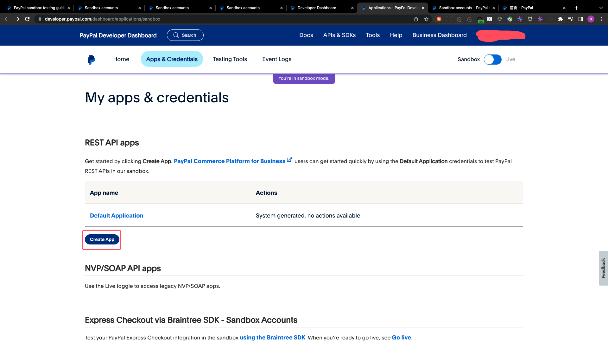
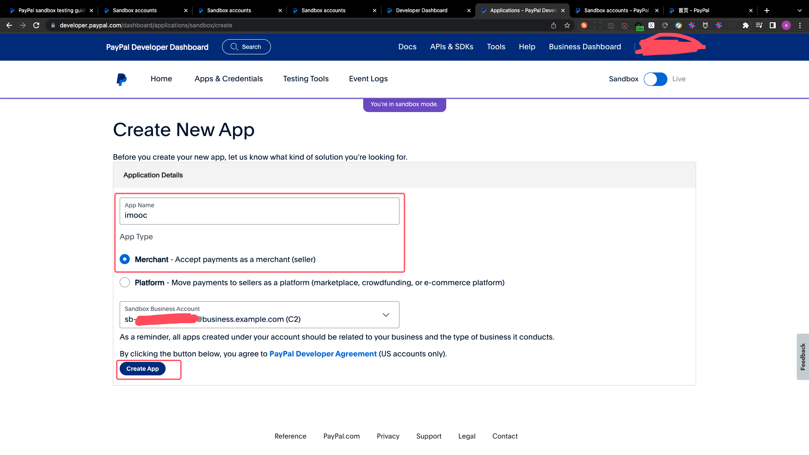
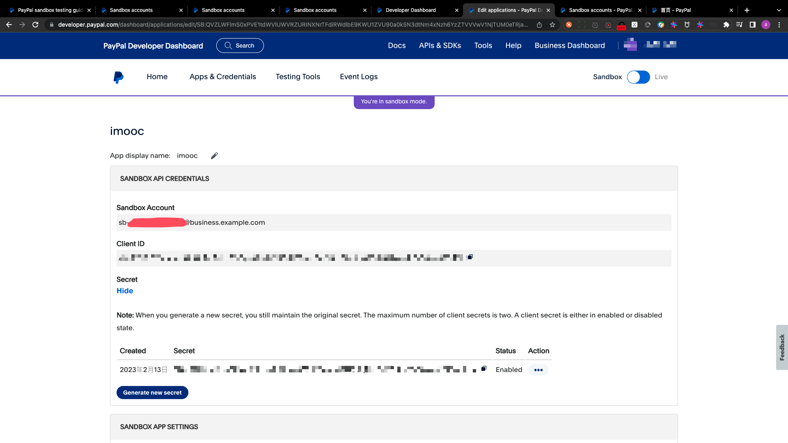

# paypal account and sandbox introduction

## PART1. PayPal账号创建说明

[创建账号](https://www.paypal.com)

[申请完成后登录](https://developer.paypal.com/)

[控制台](https://developer.paypal.com/dashboard/)

[创建沙箱应用](https://developer.paypal.com/dashboard/applications/sandbox)

[创建沙箱账号](https://developer.paypal.com/dashboard/applications/sandbox)

[沙箱账号登录地址](https://www.sandbox.paypal.com)

## PART2. 创建沙箱应用

[创建沙箱应用](https://developer.paypal.com/dashboard/applications/sandbox)

注意:此处选择business的沙箱账号.

把Client ID、Secret、2个沙箱账号的邮箱和密码都记录好,后边会用到