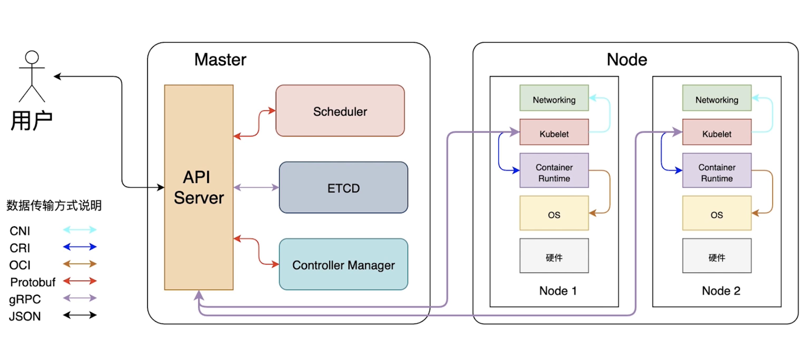
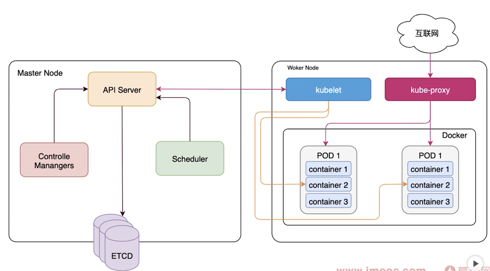

# introduction of K8S

## PART1. K8S基本介绍

什么是K8S?

- Kubernetes是谷歌开源的容器集群管理系统
- 可以简化应用程序的工作流,加快开发速度
- 最初由Google设计和开发

为什么要用K8S?

- 真正的生产型应用会涉及到多个容器
- 容器必须跨多个服务器主机部署
- 借助K8S构建跨多个容器的应用服务、跨集群调度、扩展这些容器

K8S有哪些应用?

- 跨多台主机进行容器编排
- 更加充分地利用硬件,最大程度获取运行企业应用所需的资源
- 利用自动布局、自动重启、自动复制以及自动扩展功能,对应用实施状况检查和自我修复

## PART2. K8S相关术语

- 主机(Master):用于控制K8S节点的计算机.所有任务分配都来自于此
- 节点(Node):负责执行请求和所分配任务的计算机.由K8S主机负责对节点进行控制
- 容器集(Pod):被部署在单个节点上的,且包含1个或多个容器的容器组.同一容器集中的所有容器共享同一个IP地址、IPC、主机名称及其他资源
- 服务(Service):将工作内容与容器集分离
- Kubelet:运行在节点上的服务,可读取容器清单(container manifest),确保指定的容器启动并运行
- kubectl:K8S的命令行配置工具

## PART3. K8S架构图

## PART4. K8S组件分布图

