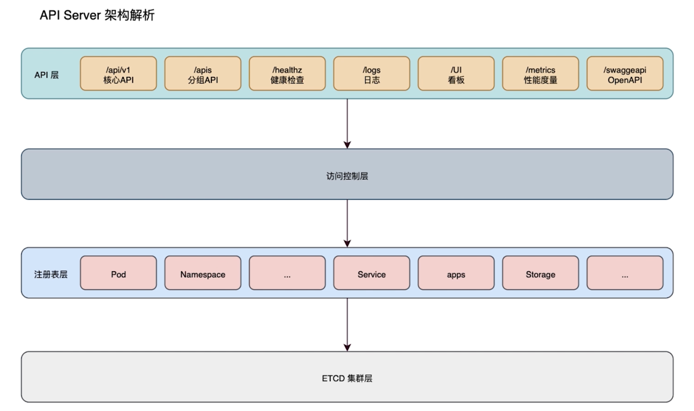
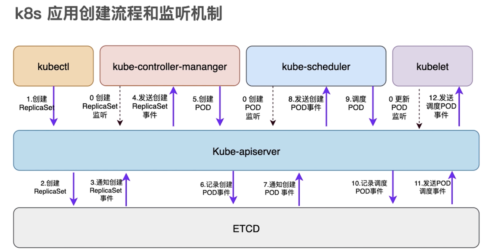

# introduction of K8S ApiServer

## PART1. K8S核心组件

- 集群管理入口:kube-apiserver
- 管理控制中心:kube-controller-manager
- 调度器:kube-scheduler
- 配置中心:etcd
- 集群管理工具:kubectl
- 节点POD管理工具:kubelet
- 服务外部代理:kube-proxy

## PART2. apiserver

## PART3. K8S应用创建流程和监听机制

