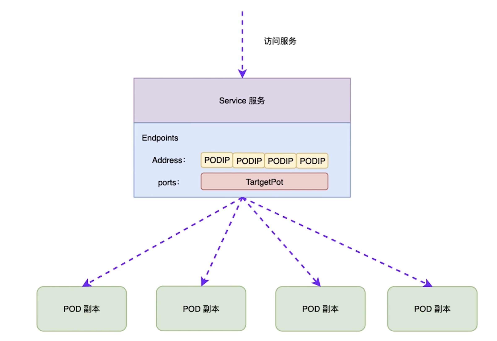

# introduction of controller

## PART1. K8S核心组件-Controller Manager

- 副本控制器:Replication Controller
- 节点控制器:Node Controller
- 资源控制器:ResourceQuota Controller
- 命名空间控制器:Namespace Controller
- Endpoints控制器:Endpoints Controller
- 服务控制器:Service Controller

## PART2. Replication Manager

- 确保在当前集群中有且仅有N个Pod实例,N是在RC中定义的Pod副本数量
- 通过调整RC的`spec.replicas`属性值来实现系统扩容或缩容
- 通过改变RC中的Pod模板(主要是镜像版本)来实现系统的滚动升级

## PART3. ResourceQuota Manager

- 容器级别:可以对CPU和Memory进行限制
- Pod级别:可以对一个Pod内所有容器的可用资源进行限制
- Namespace级别:为Namespace(多租户)级别的资源限制.包括:POD、RC、Service、ResourceQuota、Secret、PV数量

## PART4. Endpoints Controller

## PART5. Service Controller

- 监听Service的变化
- 如果一个Service是一个LoadBalancer类型,则维护LoadBalancer表